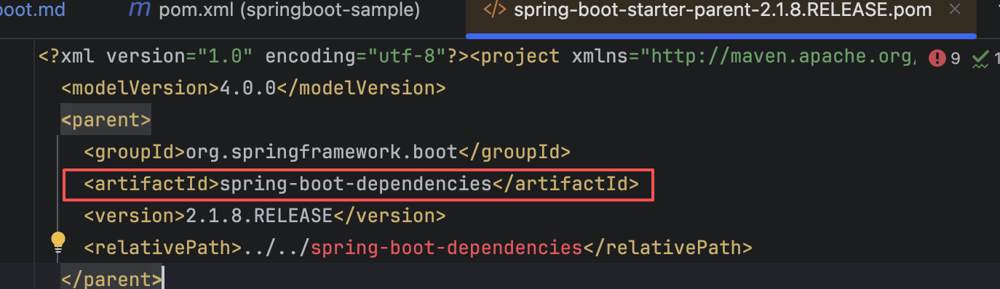
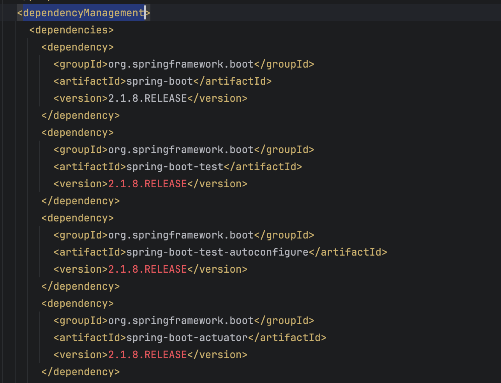
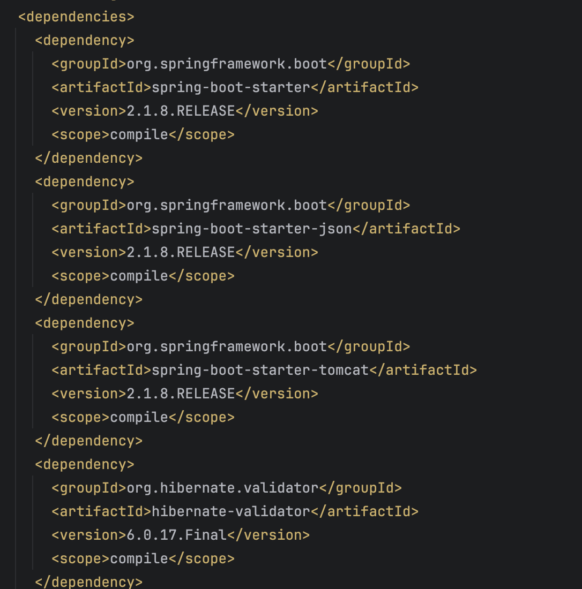

# 🚀 Spring Boot 入门指南

<!-- TOC -->
<!-- /TOC -->

---

## 什么是 Spring Boot？

想象一下，你要搭建一个网站，但是需要配置很多复杂的东西才能让它跑起来。Spring Boot 就像是一个"智能助手"，它帮你自动处理这些麻烦事，让你可以专注于写业务代码！

> **作者**: yangzhao  
> **版本**: 1.0  
> **更新时间**: 2024年  
> **预计学习时间**: 30-45分钟  
> **难度等级**: ⭐⭐☆☆☆ (入门级)

### 🎯 Spring Boot 的核心优势

**Spring Boot = Spring + 自动化配置 + 起步依赖**

- **快速上手**：几分钟就能创建一个可运行的 Web 应用
- **零配置**：大部分配置都是自动的，你不需要写复杂的 XML
- **开箱即用**：内置了 Tomcat 服务器，直接运行就能访问
- **约定优于配置**：按照约定来组织代码，减少配置工作

### 🤔 为什么需要 Spring Boot？

传统的 Spring 开发有两个大问题：

1. **配置地狱** 😵
   - 需要写很多 XML 配置文件
   - 配置复杂，容易出错
   - 新手很难上手

2. **依赖噩梦** 😱
   - 各种 jar 包版本冲突
   - 需要手动管理依赖关系
   - 经常出现兼容性问题

**Spring Boot 的解决方案：**
- ✅ 自动配置：根据你的代码自动决定使用什么配置
- ✅ 起步依赖：预定义好的一组依赖，版本都兼容

# 🎮 动手实践

## 📁 项目结构一览

让我们先看看这个 Spring Boot 项目的文件结构：

```
springboot-learning/                    👈 项目根目录
├── docs/                            📚 文档目录
│   ├── 1.first-springboot.md        📖 Spring Boot入门指南
│   ├── 2.springboot-configuration.md 📖 Spring Boot配置详解
│   └── img/                         🖼️ 图片资源
├── src/                             💻 源代码目录
│   └── main/
│       ├── java/                    ☕ Java 代码
│       │   └── org/
│       │       └── example/
│       │           ├── controller/  🎮 控制器（处理网页请求）
│       │           │   └── SayController.java
│       │           └── App.java     🚀 启动类（程序入口）
│       └── resources/               📦 资源文件
│           ├── application.properties ⚙️ Properties格式配置
│           ├── application.yml      ⚙️ YAML格式配置
│           ├── static/              🌐 静态资源
│           └── templates/           📄 模板文件
├── target/                          🏗️ 编译输出目录
├── README.md                        📋 项目说明
└── pom.xml                          ⚙️ Maven 配置文件
```

### 🔍 文件作用说明

| 文件/目录 | 作用 | 重要性 |
|----------|------|--------|
| `pom.xml` | Maven 配置文件，管理项目依赖 | ⭐⭐⭐⭐⭐ |
| `App.java` | 程序启动入口，包含 `main` 方法 | ⭐⭐⭐⭐⭐ |
| `SayController.java` | 控制器，处理网页请求 | ⭐⭐⭐⭐ |
| `application.properties` | Properties格式配置文件 | ⭐⭐⭐⭐ |
| `application.yml` | YAML格式配置文件 | ⭐⭐⭐⭐ |
| `docs/` | 存放教程和文档 | ⭐⭐⭐ |

## 🚀 快速体验

> **💡 学习建议**: 先运行项目看看效果，再深入学习原理！

### ⚡ 30秒快速启动

**第一步：运行项目**
```bash
# 在项目根目录执行
mvn spring-boot:run
```

**第二步：访问网站**
打开浏览器访问：http://localhost:8080

**第三步：查看效果**
你应该看到：`Hello World!`

### 🎯 体验目标

通过这个快速体验，你将：
- ✅ 看到 Spring Boot 应用的运行效果
- ✅ 理解 Web 应用的基本概念
- ✅ 建立学习的信心和兴趣

> **🎉 恭喜！** 如果你看到了 "Hello World!"，说明项目运行成功！现在让我们深入学习背后的原理。

---

## 1️⃣ 配置 Maven 依赖 (pom.xml)

> **📊 学习进度**: 1/7 - 项目基础配置

`pom.xml` 就像是项目的"购物清单"，告诉 Maven 需要下载哪些库。

### 🔧 关键配置解析

```xml
<!-- 🏠 继承 Spring Boot 父项目 -->
<parent>
    <groupId>org.springframework.boot</groupId>
    <artifactId>spring-boot-starter-parent</artifactId>
    <version>2.1.8.RELEASE</version>
</parent>
```
**作用**：继承 Spring Boot 的默认配置，包括版本管理、插件配置等。

```xml
<!-- 🌐 Web 应用起步依赖 -->
<dependency>
    <groupId>org.springframework.boot</groupId>
    <artifactId>spring-boot-starter-web</artifactId>
</dependency>
```
**作用**：包含创建 Web 应用所需的所有依赖，包括：
- Spring MVC（处理网页请求）
- 内嵌 Tomcat 服务器
- JSON 处理库
- 等等...

### 💡 什么是起步依赖？

起步依赖就像是一个"套餐"，包含了开发特定功能所需的所有库。比如：
- `spring-boot-starter-web` = Web 开发套餐
- `spring-boot-starter-data-jpa` = 数据库操作套餐
- `spring-boot-starter-security` = 安全认证套餐

## 2️⃣ 创建启动类 (Application)

> **📊 学习进度**: 2/7 - 应用启动核心

启动类就像是程序的"总开关"，负责启动整个 Spring Boot 应用。

### 🚀 启动类代码解析

```java
package org.example;

import org.springframework.boot.SpringApplication;
import org.springframework.boot.autoconfigure.SpringBootApplication;

/**
 * 引导类，启动 Spring Boot项目的入口
 * @author yangzhao
 */
@SpringBootApplication          // 🏷️ 告诉 Spring：这是启动类
public class App {
    public static void main(String[] args) {
        System.out.println("Hello and welcome!");  // 👋 启动时的欢迎信息

        // 启动方法
        SpringApplication.run(App.class, args);
    }
}
```

### 🔍 关键点解析

| 部分 | 作用 | 说明 |
|------|------|------|
| `@SpringBootApplication` | 启动类标记 | 告诉 Spring 这是主启动类，包含自动配置 |
| `main` 方法 | 程序入口 | Java 程序的固定入口点 |
| `SpringApplication.run()` | 启动应用 | 启动 Spring Boot 应用和内置服务器 |

### 🎯 启动过程

1. **加载配置**：读取 `application.properties` 等配置文件
2. **自动配置**：根据依赖自动配置各种组件
3. **启动服务器**：启动内嵌的 Tomcat 服务器（默认端口 8080）
4. **扫描组件**：扫描并注册所有的 Controller、Service 等
5. **准备就绪**：应用启动完成，可以接收请求

### 🏃‍♂️ 如何运行

**方法一：IDE 运行**
1. 在 IDE 中右键点击 `App.java`
2. 选择 "Run App" 或 "Debug App"

**方法二：命令行运行**
```bash
# 编译项目
mvn clean compile

# 运行项目
mvn spring-boot:run
```

**方法三：打包运行**
```bash
# 打包项目
mvn clean package

# 运行jar包
java -jar target/springboot-learning-1.0-SNAPSHOT.jar
```

## 3️⃣ 创建控制器 (Controller)

> **📊 学习进度**: 3/7 - 业务逻辑处理

控制器就像是网站的"服务员"，负责接收用户的请求并返回响应。

### 🎮 控制器代码解析

```java
package org.example.controller;

import org.springframework.stereotype.Controller;
import org.springframework.web.bind.annotation.GetMapping;
import org.springframework.web.bind.annotation.ResponseBody;

/**
 * @author yangzhao
 */
@Controller                    // 🏷️ 告诉 Spring：这是一个控制器
public class SayController {

    @ResponseBody              // 📤 直接返回字符串，不跳转页面
    @GetMapping("/")           // 🌐 处理 GET 请求，路径是根路径 "/"
    public String sayHello() {
        return "Hello World!"; // 💬 返回给用户的消息
    }
}
```

### 🔍 注解详解

| 注解 | 作用 | 类比 |
|------|------|------|
| `@Controller` | 标记这是一个控制器类 | 给服务员戴上"服务员"的胸牌 |
| `@GetMapping("/")` | 处理根路径的 GET 请求 | 当用户访问网站首页时，调用这个方法 |
| `@ResponseBody` | 直接返回字符串内容 | 直接给用户看文字，不跳转到其他页面 |

### 🌐 访问效果

当你在浏览器访问 `http://localhost:8080/` 时，会看到：
```
Hello World!
```

## 4️⃣ 配置文件管理

> **📊 学习进度**: 4/7 - 应用配置管理

Spring Boot 支持多种配置文件格式，本项目同时支持 Properties 和 YAML 两种格式。

### 📝 Properties 格式配置

**文件位置**: `src/main/resources/application.properties`

```properties
# 服务器端口配置
server.port=8080
```

### 📝 YAML 格式配置

**文件位置**: `src/main/resources/application.yml`

```yaml
server:
  port: 8080
```

### 🔧 配置优先级

当同时存在两种格式的配置文件时，Properties 格式的优先级更高。

### 💡 配置格式选择建议

| 场景 | 推荐格式 | 原因 |
|------|----------|------|
| 简单配置 | Properties | 直观易懂，适合简单键值对 |
| 复杂配置 | YAML | 结构清晰，支持嵌套对象 |
| 团队协作 | 统一格式 | 保持项目一致性 |

# 🎁 起步依赖详解

## 什么是起步依赖？

起步依赖就像是"懒人包"，把开发特定功能需要的所有库都打包在一起，你只需要引入一个依赖，就能获得完整的功能。

## 1️⃣ spring-boot-starter-parent

### 🏠 父项目的作用

```xml
<parent>
    <groupId>org.springframework.boot</groupId>
    <artifactId>spring-boot-starter-parent</artifactId>
    <version>2.1.8.RELEASE</version>
</parent>
```

**作用**：为项目提供默认配置，包括：
- 📦 依赖版本管理
- 🔧 插件配置
- 📋 资源文件处理规则
- 🏗️ 构建配置

### 🔗 依赖关系图



`spring-boot-starter-parent` 继承了 `spring-boot-dependencies`，在后者中定义了所有依赖的版本信息。



**版本管理的好处**：
- ✅ 避免版本冲突
- ✅ 自动选择兼容的版本
- ✅ 简化配置工作

## 2️⃣ spring-boot-starter-web

### 🌐 Web 开发套餐

```xml
<dependency>
    <groupId>org.springframework.boot</groupId>
    <artifactId>spring-boot-starter-web</artifactId>
</dependency>
```

**包含的组件**：
- 🎮 Spring MVC（处理 Web 请求）
- 🐱 Tomcat 服务器（内嵌）
- 📝 Jackson（JSON 处理）
- 🔧 Spring Boot 自动配置



### 💡 起步依赖的优势

| 传统方式 | Spring Boot 起步依赖 |
|---------|---------------------|
| 需要手动添加多个依赖 | 一个依赖搞定 |
| 需要管理版本兼容性 | 自动处理版本 |
| 配置复杂 | 零配置 |
| 容易出错 | 开箱即用 |

## 🎯 总结

通过起步依赖，Spring Boot 让 Web 开发变得：
- **简单**：一个依赖包含所有功能
- **快速**：几分钟搭建可运行的应用
- **可靠**：版本兼容性自动处理
- **高效**：专注业务逻辑，不用管配置

---

# 🚀 快速上手实践

## 📋 完整步骤清单

### 第一步：运行项目
1. 在 IDE 中打开项目
2. 右键点击 `App.java`
3. 选择 "Run App" 或 "Debug App"
4. 等待控制台显示 "Started App in X.XXX seconds"

### 第二步：访问网站
1. 打开浏览器
2. 访问 `http://localhost:8080`
3. 你应该看到 "Hello World!" 消息

> **注意**: 项目同时支持 Properties 和 YAML 两种配置格式，默认端口为 8080

### 第三步：修改内容
1. 打开 `SayController.java`
2. 修改 `return "Hello World!";` 为 `return "你好，Spring Boot！";`
3. 重新运行项目
4. 刷新浏览器，查看变化

### 🎯 实践练习

**练习1：添加新的API端点**
在 `SayController` 中添加一个新的方法：
```java
@GetMapping("/hello")
public String hello() {
    return "Hello from Spring Boot!";
}
```
然后访问 `http://localhost:8080/hello` 查看效果。

**练习2：修改端口**
在 `application.properties` 中修改端口：
```properties
server.port=8081
```
然后访问 `http://localhost:8081` 查看效果。

**练习3：添加配置信息**
在 `application.yml` 中添加应用信息：
```yaml
app:
  name: "我的第一个Spring Boot应用"
  version: "1.0.0"
```

## ✅ 学习检查点

完成以下检查，确认你已经掌握了 Spring Boot 基础：

- [ ] **项目运行** - 能够成功启动 Spring Boot 应用
- [ ] **访问应用** - 能够在浏览器中看到 "Hello World!" 消息
- [ ] **理解结构** - 知道 `App.java` 是启动类，`SayController.java` 是控制器
- [ ] **配置管理** - 了解 Properties 和 YAML 两种配置格式
- [ ] **依赖理解** - 知道 `spring-boot-starter-web` 的作用
- [ ] **实践完成** - 完成了至少一个实践练习

> **🎉 如果以上都完成了，恭喜你！你已经掌握了 Spring Boot 的基础知识！**

## 🎯 下一步学习

- 📖 **深入学习配置**: [Spring Boot 配置详解](docs/2.springboot-configuration.md)
- 🌐 **扩展 API 接口**: 添加更多 REST 端点
- 🗄️ **数据库集成**: 学习 Spring Data JPA
- 🔐 **安全认证**: 集成 Spring Security
- 📊 **监控管理**: 添加 Actuator 监控
- 🧪 **单元测试**: 编写测试用例

## ❓ 常见问题

**Q: 启动时报错怎么办？**
A: 检查 Java 版本是否为 8 或以上，确保 Maven 依赖下载完成。

**Q: 访问 8080 端口失败？**
A: 确认应用已成功启动，检查控制台是否有错误信息。

**Q: 如何修改端口？**
A: 在 `application.properties` 中添加 `server.port=8081` 或在 `application.yml` 中修改端口配置

**Q: Properties 和 YAML 配置有什么区别？**
A: Properties 格式简单直观，YAML 格式结构清晰，项目同时支持两种格式，Properties 优先级更高

**Q: 如何添加新的依赖？**
A: 在 `pom.xml` 的 `<dependencies>` 标签中添加新的 `<dependency>` 配置

## 🎉 恭喜！

你已经成功创建了第一个 Spring Boot 应用！🎊

### 📋 项目总结

通过这个教程，你已经学会了：

✅ **项目结构理解** - 了解了 Spring Boot 项目的标准目录结构  
✅ **Maven 配置** - 掌握了起步依赖的使用方法  
✅ **控制器开发** - 学会了创建 REST API 接口  
✅ **配置管理** - 理解了 Properties 和 YAML 两种配置格式  
✅ **应用启动** - 掌握了 Spring Boot 应用的启动方式  
✅ **开发流程** - 体验了完整的开发、运行、测试流程  

### 🔗 相关资源

- **项目仓库**: [springboot-learning](https://github.com/yangzhao917/springboot-learning)
- **详细配置**: [Spring Boot 配置详解](docs/2.springboot-configuration.md)
- **官方文档**: [Spring Boot 官方文档](https://spring.io/projects/spring-boot)

---

**继续学习，探索更多 Spring Boot 的强大功能！** 🚀