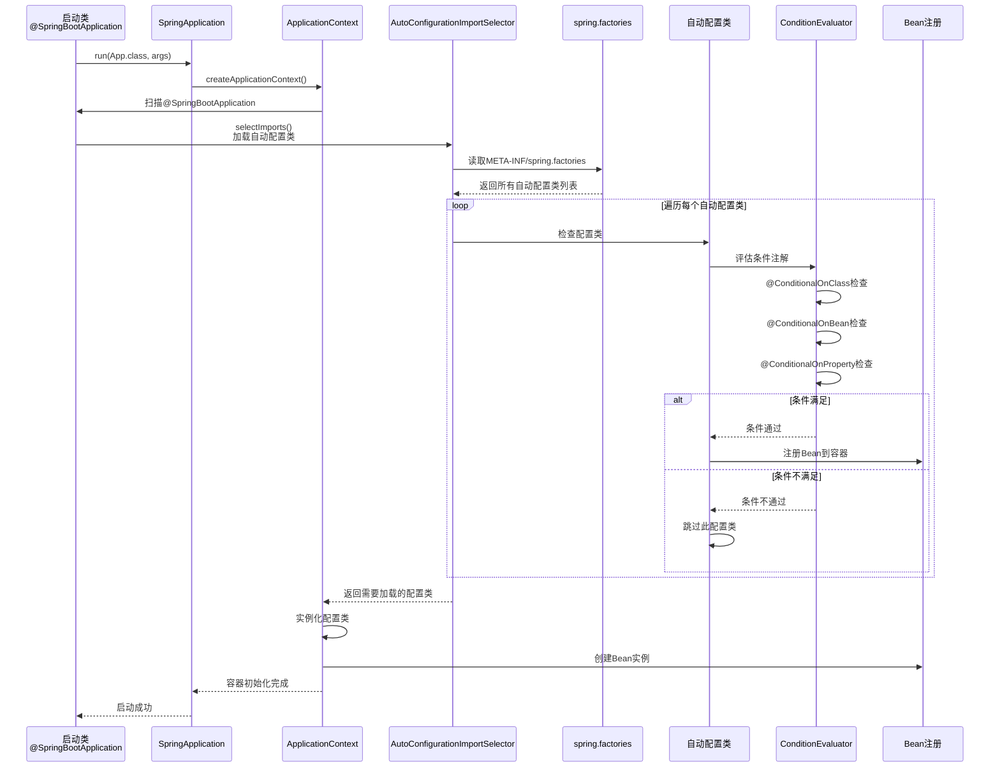

# Spring Boot 自动配置详解

> 摘要（TL;DR）
> - 目标：读懂并运用 Spring Boot 自动配置，能编写自定义自动配置
> - 学会：`@EnableAutoConfiguration`、`@Enable`/`@Import`、Condition 条件装配、动态加载
> - 收获：会写 Starter、会看时序图、能排查生效与否及冲突问题

## 📚 目录

- [内容概览](#内容概览)
- [4.1 什么是自动配置](#41-什么是自动配置)
- [4.2 @Enable 与 @Import 注解实用指南](#42-enable-与-import-注解实用指南)
- [4.3 切换内置Web服务器](#43-切换内置web服务器)
- [4.4 如何编写自动配置](#44-如何编写自动配置)
- [4.5 Condition条件注解的使用](#45-condition条件注解的使用)
- [4.6 自定义 Starter 实现](#46-自定义-starter-实现)
- [4.7 动态加载配置 excute流程](#47-动态加载配置)
- [4.8 自动配置执行原理时序图](#48-自动配置执行原理时序图)
- [4.9 使用场景和实践](#49-使用场景和实践)
- [4.10 常见问题与解决方案](#410-常见问题与解决方案)
- [4.11 总结](#411-总结)

---

## 内容概览

本文档全面介绍Spring Boot自动配置机制，帮助初学者深入理解自动配置的原理和使用方式。

### 📚 主要内容

#### 第一部分：自动配置基础
- **自动配置概念**：什么是自动配置，为什么要使用自动配置
- **核心构件**：`@EnableAutoConfiguration`、`spring.factories`文件、自动配置类等
- **工作原理**：自动配置如何被触发和执行

#### 第二部分：自定义自动配置
- **编写步骤**：创建配置类、条件注解、配置属性类
- **Condition条件注解**：各种Condition类型详解和实战案例
- **动态加载**：如何实现配置的动态加载和刷新

#### 第三部分：深入原理
- **执行流程**：自动配置的完整执行时序图
- **源码分析**：关键类和方法的解析
- **调试技巧**：如何查看和调试自动配置

#### 第四部分：实践应用
- **使用场景**：适合使用自动配置的场景
- **最佳实践**：编写自动配置的最佳方式
- **常见问题**：开发中常见问题的解决方案

### 🧭 推荐阅读顺序（由浅入深）
1. 4.1 什么是自动配置：先理解“它是什么/为什么需要”
2. 4.2 @Enable 与 @Import：掌握“开关与导入”的基本机制
3. 4.10 切换内置Web服务器：快速实践一个可见效果的小改动
4. 4.3 如何编写自动配置：开始动手写自己的自动配置
5. 4.4 Condition 条件注解：按需加载的关键技能
6. 4.12 自定义 Starter 实现：封装成可复用组件
7. 4.5 动态加载配置：了解运行期变更与刷新
8. 4.6 自动配置执行原理时序图：建立整体模型
9. 4.7 使用场景和实践：把知识放到实际场景
10. 4.8 常见问题与解决方案：定位与排障

### 🔧 核心依赖

自动配置功能已经包含在以下依赖中：

- **spring-boot-autoconfigure**：自动配置核心模块（已包含在`spring-boot-starter`中）
- **spring-boot-configuration-processor**：配置元数据生成工具（可选）
- **spring-boot-starter**：Spring Boot基础起步依赖

### 🎯 核心特性

- **零配置启动**：按照约定自动配置应用
- **条件化配置**：根据条件决定是否加载某个配置
- **按需加载**：只加载实际需要的配置
- **易于扩展**：可以自定义自动配置

---

## 4.1 什么是自动配置

### 🤔 什么是自动配置？

**自动配置（Auto Configuration）**是Spring Boot的核心特性之一。它能够根据项目中引入的依赖和配置，自动配置Spring应用程序需要的Bean。

### 💡 生活中的比喻

想象你要做一道菜：
- **传统方式（Spring）**：你需要自己准备所有食材和调料，按照菜谱一步步操作
- **自动配置（Spring Boot）**：你只需要告诉系统"我要做宫保鸡丁"，系统会自动准备好所有需要的食材和调料，你直接开做就行！

### 🎯 为什么需要自动配置？

#### 传统Spring开发的问题

```java
// 传统Spring配置 - 需要大量XML或Java配置
@Configuration
public class DataSourceConfig {
    @Bean
    public DataSource dataSource() {
        HikariConfig config = new HikariConfig();
        config.setJdbcUrl("jdbc:mysql://localhost:3306/mydb");
        config.setUsername("root");
        config.setPassword("123456");
        config.setDriverClassName("com.mysql.cj.jdbc.Driver");
        // ... 更多配置
        return new HikariDataSource(config);
    }
}
```

#### Spring Boot自动配置的解决方案

```java
// Spring Boot - 只需要在配置文件中指定连接信息
// application.properties
spring.datasource.url=jdbc:mysql://localhost:3306/mydb
spring.datasource.username=root
spring.datasource.password=123456
spring.datasource.driver-class-name=com.mysql.cj.jdbc.Driver
```

Spring Boot会自动检测到你配置了数据库连接信息，然后自动创建`DataSource` Bean！

### ✨ 自动配置的优势

| 特性 | 传统Spring | Spring Boot自动配置 |
|------|-----------|-------------------|
| 配置复杂度 | 🟥 高 | 🟢 低 |
| 代码量 | 🟥 多 | 🟢 少 |
| 学习曲线 | 🟥 陡峭 | 🟢 平缓 |
| 出错概率 | 🟥 高 | 🟢 低 |
| 开发效率 | 🟥 慢 | 🟢 快 |

### 🔍 自动配置工作原理

1. **扫描条件**：检查classpath下是否有特定的类
2. **检查配置**：查看配置文件或环境变量
3. **创建Bean**：如果条件满足，自动创建相应的Bean
4. **应用配置**：将配置文件中的属性应用到Bean上

---

## 4.2 @Enable 与 @Import 注解实用指南

### 🧠 快速理解
- `@EnableXxx`：一个“开关”注解，打开某个功能
- `@Import`：把某些配置类/Bean 定义“导入”到容器

`@EnableXxx` 的本质就是“注解 + @Import”。

### 1) 直接导入配置类（最简单）

```java
// 业务配置类
@Configuration
public class FeatureConfiguration {
    @Bean
    public FeatureService featureService() {
        return new FeatureService();
    }
}

// 开关注解
@Target(ElementType.TYPE)
@Retention(RetentionPolicy.RUNTIME)
@Import(FeatureConfiguration.class)
public @interface EnableFeature {}

// 使用
@EnableFeature
@SpringBootApplication
public class App {}
```

### 2) 使用 ImportSelector（按条件/名称动态选择）

```java
public class FeatureImportSelector implements ImportSelector {
    @Override
    public String[] selectImports(AnnotationMetadata metadata) {
        // 可以按环境/配置返回不同配置类
        return new String[]{"org.example.config.FeatureConfiguration"};
    }
}

@Target(ElementType.TYPE)
@Retention(RetentionPolicy.RUNTIME)
@Import(FeatureImportSelector.class)
public @interface EnableFeature {}
```

### 3) 使用 ImportBeanDefinitionRegistrar（手工注册 Bean）

```java
public class FeatureRegistrar implements ImportBeanDefinitionRegistrar {
    @Override
    public void registerBeanDefinitions(AnnotationMetadata meta, BeanDefinitionRegistry registry) {
        RootBeanDefinition bd = new RootBeanDefinition(FeatureService.class);
        registry.registerBeanDefinition("featureService", bd);
    }
}

@Target(ElementType.TYPE)
@Retention(RetentionPolicy.RUNTIME)
@Import(FeatureRegistrar.class)
public @interface EnableFeature {}
```

### 4) @EnableAutoConfiguration 深入
- 它本质上也是一个 `@Enable` 注解：内部通过 `@Import(AutoConfigurationImportSelector.class)` 把自动配置类批量导入
- 排除方式：

```java
@SpringBootApplication(exclude = {DataSourceAutoConfiguration.class})
public class App {}
```

```properties
spring.autoconfigure.exclude=org.springframework.boot.autoconfigure.jdbc.DataSourceAutoConfiguration
```

---

## 4.3 切换内置Web服务器

### 🤔 背景
Spring Boot Web 默认使用内置 Tomcat。你也可以切换为 Jetty 或 Undertow，常见需求包括更轻量、更少内存占用或更适合长连接。

### 📦 切换到 Jetty（推荐方式）

在 `pom.xml` 中：

```xml
<dependencies>
    <!-- Web 起步，排除 Tomcat -->
    <dependency>
        <groupId>org.springframework.boot</groupId>
        <artifactId>spring-boot-starter-web</artifactId>
        <exclusions>
            <exclusion>
                <groupId>org.springframework.boot</groupId>
                <artifactId>spring-boot-starter-tomcat</artifactId>
            </exclusion>
        </exclusions>
    </dependency>

    <!-- 引入 Jetty -->
    <dependency>
        <groupId>org.springframework.boot</groupId>
        <artifactId>spring-boot-starter-jetty</artifactId>
    </dependency>
</dependencies>
```

### 📦 切换到 Undertow

```xml
<dependencies>
    <dependency>
        <groupId>org.springframework.boot</groupId>
        <artifactId>spring-boot-starter-web</artifactId>
        <exclusions>
            <exclusion>
                <groupId>org.springframework.boot</groupId>
                <artifactId>spring-boot-starter-tomcat</artifactId>
            </exclusion>
        </exclusions>
    </dependency>

    <dependency>
        <groupId>org.springframework.boot</groupId>
        <artifactId>spring-boot-starter-undertow</artifactId>
    </dependency>
</dependencies>
```

### 🔧 可选配置

```properties
# 常用
server.port=8080
server.tomcat.max-threads=200   # 仅 Tomcat 生效
server.jetty.threads.max=200    # 仅 Jetty 生效
server.undertow.threads.worker=64  # 仅 Undertow 生效

# 开启 HTTP/2（需要 JDK 与容器支持）
server.http2.enabled=true
```

### ✅ 选择建议
- Tomcat：默认、通用场景皆可
- Jetty：更轻量，长连接、低内存占用更友好
- Undertow：高并发、异步 I/O 适配更好

---

## 4.4 如何编写自动配置

### 🎯 编写步骤概览

编写自动配置类通常需要以下步骤：

1. **创建配置属性类**：用于绑定配置文件的属性
2. **创建自动配置类**：包含Bean定义和条件注解
3. **注册自动配置类**：在`spring.factories`中注册
4. **测试验证**：确保自动配置正常工作

### 📝 实战案例：自定义Redis自动配置

让我们创建一个完整的自动配置示例。

#### 步骤1：创建配置属性类

```java
package org.example.autoconfigure.redis;

import org.springframework.boot.context.properties.ConfigurationProperties;

/**
 * Redis配置属性类
 * 用于绑定配置文件中的 my.redis.* 属性
 */
@ConfigurationProperties(prefix = "my.redis")
public class MyRedisProperties {
    
    /**
     * Redis服务器地址
     */
    private String host = "localhost";
    
    /**
     * Redis服务器端口
     */
    private int port = 6379;
    
    /**
     * 连接超时时间（毫秒）
     */
    private int timeout = 2000;
    
    /**
     * 密码
     */
    private String password;
    
    /**
     * 数据库索引（默认0）
     */
    private int database = 0;
    
    // Getter和Setter方法
    public String getHost() {
        return host;
    }
    
    public void setHost(String host) {
        this.host = host;
    }
    
    public int getPort() {
        return port;
    }
    
    public void setPort(int port) {
        this.port = port;
    }
    
    public int getTimeout() {
        return timeout;
    }
    
    public void setTimeout(int timeout) {
        this.timeout = timeout;
    }
    
    public String getPassword() {
        return password;
    }
    
    public void setPassword(String password) {
        this.password = password;
    }
    
    public int getDatabase() {
        return database;
    }
    
    public void setDatabase(int database) {
        this.database = database;
    }
}
```

**说明**：
- `@ConfigurationProperties(prefix = "my.redis")`：绑定`application.properties`中以`my.redis`开头的属性
- 提供默认值：如`host = "localhost"`、`port = 6379`
- 提供完整的Getter和Setter方法

#### 步骤2：创建自动配置类

```java
package org.example.autoconfigure.redis;

import org.slf4j.Logger;
import org.slf4j.LoggerFactory;
import org.springframework.boot.autoconfigure.condition.ConditionalOnClass;
import org.springframework.boot.autoconfigure.condition.ConditionalOnMissingBean;
import org.springframework.boot.autoconfigure.condition.ConditionalOnProperty;
import org.springframework.boot.context.properties.EnableConfigurationProperties;
import org.springframework.context.annotation.Bean;
import org.springframework.context.annotation.Configuration;

/**
 * 自定义Redis自动配置类
 */
@Configuration  // 标识这是一个配置类
@ConditionalOnClass(name = "redis.clients.jedis.Jedis")  // 当classpath中存在Jedis类时才生效
@EnableConfigurationProperties(MyRedisProperties.class)  // 启用配置属性绑定
@ConditionalOnProperty(prefix = "my.redis", name = "enabled", havingValue = "true", matchIfMissing = true)
public class MyRedisAutoConfiguration {
    
    private static final Logger logger = LoggerFactory.getLogger(MyRedisAutoConfiguration.class);
    
    /**
     * 配置属性
     */
    private final MyRedisProperties properties;
    
    /**
     * 通过构造函数注入配置属性
     */
    public MyRedisAutoConfiguration(MyRedisProperties properties) {
        this.properties = properties;
        logger.info("MyRedisAutoConfiguration初始化，host: {}, port: {}", 
                    properties.getHost(), properties.getPort());
    }
    
    /**
     * 创建Redis操作模板Bean
     * 只有当容器中不存在MyRedisTemplate类型的Bean时才会创建
     */
    @Bean
    @ConditionalOnMissingBean(MyRedisTemplate.class)
    public MyRedisTemplate myRedisTemplate() {
        logger.info("创建MyRedisTemplate Bean");
        MyRedisTemplate template = new MyRedisTemplate();
        template.setHost(properties.getHost());
        template.setPort(properties.getPort());
        template.setTimeout(properties.getTimeout());
        template.setPassword(properties.getPassword());
        template.setDatabase(properties.getDatabase());
        return template;
    }
}
```

鉴于此文件可能不存在，我们先创建MyRedisTemplate类：

```java
package org.example.autoconfigure.redis;

/**
 * 自定义Redis操作模板
 * 这是一个简化的示例类
 */
public class MyRedisTemplate {
    
    private String host;
    private int port;
    private int timeout;
    private String password;
    private int database;
    
    // Getter和Setter方法
    public String getHost() {
        return host;
    }
    
    public void setHost(String host) {
        this.host = host;
    }
    
    public int getPort() {
        return port;
    }
    
    public void setPort(int port) {
        this.port = port;
    }
    
    public int getTimeout() {
        return timeout;
    }
    
    public void setTimeout(int timeout) {
        this.timeout = timeout;
    }
    
    public String getPassword() {
        return password;
    }
    
    public void setPassword(String password) {
        this.password = password;
    }
    
    public int getDatabase() {
        return database;
    }
    
    public void setDatabase(int database) {
        this.database = database;
    }
    
    @Override
    public String toString() {
        return "MyRedisTemplate{" +
                "host='" + host + '\'' +
                ", port=" + port +
                ", timeout=" + timeout +
                ", database=" + database +
                '}';
    }
}
```

#### 步骤3：注册自动配置类

在`src/main/resources/META-INF/`目录下创建`spring.factories`文件：

```properties
# Auto Configure
org.springframework.boot.autoconfigure.EnableAutoConfiguration=\
org.example.autoconfigure.redis.MyRedisAutoConfiguration
```

**注意**：
- 文件路径必须准确：`META-INF/spring.factories`
- 使用反斜杠`\`可以换行，提高可读性
- 多个自动配置类用逗号分隔或每行一个

#### 步骤4：配置文件

在`application.properties`中添加配置：

```properties
# 启用自定义Redis自动配置
my.redis.enabled=true
my.redis.host=127.0.0.1
my.redis.port=6379
my.redis.timeout=3000
my.redis.password=123456
my.redis.database=0
```

#### 步骤5：使用自动配置

在Service或Controller中直接注入使用：

```java
package org.example.service;

import org.example.autoconfigure.redis.MyRedisTemplate;
import org.springframework.beans.factory.annotation.Autowired;
import org.springframework.stereotype.Service;

@Service
public class RedisService {
    
    @Autowired
    private MyRedisTemplate myRedisTemplate;
    
    public void testRedis() {
        System.out.println("Redis配置: " + myRedisTemplate);
    }
}
```

### 🎨 完整代码示例总结

```
src/main/java/org/example/autoconfigure/redis/
├── MyRedisProperties.java        # 配置属性类
├── MyRedisTemplate.java          # Redis操作模板
└── MyRedisAutoConfiguration.java # 自动配置类

src/main/resources/
├── META-INF/
│   └── spring.factories          # 自动配置注册文件
└── application.properties        # 配置文件
```

---

## 4.5 Condition条件注解的使用

### 🎯 什么是Condition？

Condition是Spring Boot自动配置的条件判断机制。它允许我们根据特定条件决定是否加载某个Bean或配置类。

### 💡 生活中的比喻

想象你在做菜：
- **@ConditionalOnClass**：只有当你有了锅，才准备做菜的材料
- **@ConditionalOnProperty**：只有当你说"我要做辣的"，才放辣椒
- **@ConditionalOnMissingBean**：如果你还没准备盘子，我就帮你准备一个

### 📋 常用Condition注解详解

#### 1. @ConditionalOnClass

**作用**：当classpath中存在指定的类时才生效。

```java
@Configuration
@ConditionalOnClass(name = "org.springframework.data.redis.core.RedisTemplate")
public class RedisAutoConfiguration {
    // 只有当RedisTemplate类存在时，这个配置类才会被加载
}
```

**使用场景**：
- 检查某个依赖是否被引入
- 确保依赖的类可用

**示例**：

```java
@Configuration
@ConditionalOnClass({Jedis.class, RedisOperations.class})
public class MyRedisAutoConfiguration {
    // 只有当classpath中同时存在Jedis和RedisOperations类时才生效
}
```

#### 2. @ConditionalOnMissingClass

**作用**：当classpath中不存在指定的类时才生效。

```java
@Configuration
@ConditionalOnMissingClass("org.springframework.data.redis.core.RedisTemplate")
public class SimpleRedisAutoConfiguration {
    // 只有当RedisTemplate类不存在时，这个配置类才会被加载
}
```

#### 3. @ConditionalOnBean

**作用**：当Spring容器中存在指定的Bean时才生效。

```java
@Configuration
public class MyConfiguration {
    
    @Bean
    @ConditionalOnBean(DataSource.class)
    public JdbcTemplate jdbcTemplate(DataSource dataSource) {
        // 只有当DataSource Bean存在时，才创建JdbcTemplate
        return new JdbcTemplate(dataSource约);
    }
}
```

**使用场景**：
- 当某个Bean存在时才创建依赖它的Bean
- 确保依赖的Bean已经准备好

#### 4. @ConditionalOnMissingBean

**作用**：当Spring容器中不存在指定的Bean时才生效。

```java
@Configuration
public class RedisAutoConfiguration {
    
    @Bean
    @ConditionalOnMissingBean(RedisTemplate.class)
    public RedisTemplate<String, Object> redisTemplate() {
        // 只有当RedisTemplate Bean不存在时，才创建默认的RedisTemplate
        return new RedisTemplate<>();
    }
}
```

**使用场景**：
- **提供默认配置**：如果用户没有自定义，就使用自动配置的默认Bean
- **避免重复创建**：防止重复创建相同类型的Bean

**重要**：这是自动配置中最常用的Condition注解！

#### 5. @ConditionalOnProperty

**作用**：根据配置属性的值来决定是否生效。

```java
@Configuration
@ConditionalOnProperty(
    prefix = "spring.redis",      // 配置前缀
    name = "enabled",              // 配置属性名
    havingValue = "true",          // 期望的值
    matchIfMissing = true          // 如果配置不存在，是否匹配（默认false）
)
public class RedisAutoConfiguration {
    // 只有当spring.redis.enabled=true时，这个配置类才会生效
    // 如果配置不存在，默认也生效（因为matchIfMissing=true）
}
```

**使用场景**：
- **功能开关**：允许用户通过配置启用或禁用某个功能
- **环境适配**：根据不同的环境配置加载不同的组件

**完整示例**：

```java
@Configuration
@ConditionalOnProperty(
    prefix = "my.feature",
    name = "cache.enabled",
    havingValue = "true",
    matchIfMissing = false  // 配置不存在时不生效
)
public class CacheAutoConfiguration {
    // 只有当my.feature.cache.enabled=true时才生效
}
```

对应的配置文件：

```properties
# 启用缓存功能
my.feature.cache.enabled=true
```

#### 6. @ConditionalOnExpression

**作用**：使用SpEL表达式来判断是否生效。

```java
@Configuration
@ConditionalOnExpression(
    "'${spring.profiles.active}' == 'dev' || '${spring.profiles.active}' == 'test'"
)
public class DevAutoConfiguration {
    // 只有当激活的profile是dev或test时才生效
}
```

**使用场景**：
- **复杂条件判断**：当简单的条件注解无法满足需求时
- **多条件组合**：使用逻辑运算符组合多个条件

**SpEL表达式示例**：

```java
// 条件1：端口号大于8000
@ConditionalOnExpression("${server.port} > 8000")

// 条件2：多个配置属性的组合
@ConditionalOnExpression(
    "${app.feature.enabled:false} && ${app.feature.type:simple} == 'advanced'"
)

// 条件3：检查Bean是否存在
@ConditionalOnExpression("@dataSource != null")
```

#### 7. @ConditionalOnWebApplication

**作用**：当应用是Web应用时才生效。

```java
@Configuration
@ConditionalOnWebApplication(type = ConditionalOnWebApplication.Type.SERVLET)
public class WebAutoConfiguration {
    // 只有当应用是Servlet Web应用时才生效
}
```

**类型**：
- `Type.SERVLET`：Servlet Web应用（如Spring MVC）
- `Type.REACTIVE`：响应式Web应用（如WebFlux）
- `Type.ANY`：任何类型的Web应用

#### 8. @ConditionalOnNotWebApplication

**作用**：当应用不是Web应用时才生效。

```java
@Configuration
@ConditionalOnNotWebApplication
public class ConsoleAutoConfiguration {
    // 只有当应用不是Web应用时才生效
}
```

### 🎯 条件注解组合使用

多个条件注解可以同时使用，它们是**AND（与）**的关系：

```java
@Configuration
@ConditionalOnClass({RedisOperations.class})
@ConditionalOnProperty(prefix = "spring.redis", name = "enabled", havingValue = "true", matchIfMissing = true)
@ConditionalOnMissingBean(RedisTemplate.class)
public class RedisAutoConfiguration {
    // Store满足以下所有条件才生效：
    // 1. classpath中存在RedisOperations类
    // 2. spring.redis.enabled=true（或配置不存在）
    // 3. 容器中不存在RedisTemplate Bean
}
```

### 📊 条件注解对比表

| 注解 | 检查对象 | 条件 | 常用场景 |
|------|---------|------|----------|
| `@ConditionalOnClass` | Classpath | 类存在 | 依赖检查 |
| `@ConditionalOnMissingClass` | Classpath | 类不存在 | 避免冲突 |
| `@ConditionalOnBean` | Spring容器 | Bean存在 | 依赖注入检查 |
| `@ConditionalOnMissingBean` | Spring容器 | Bean不存在 | 提供默认Bean |
| `@ConditionalOnProperty` | 配置文件 | 属性值匹配 | 功能开关 |
| `@ConditionalOnExpression` | SpEL表达式 | 表达式为true | 复杂条件 |
| `@ConditionalOnWebApplication` | 应用类型 | 是Web应用 | Web相关配置 |
| `@ConditionalOnNotWebApplication` | 应用类型 | 不是Web应用 | 非Web配置 |

### 💻 实战案例：多环境条件配置

创建一个根据环境自动选择数据源的配置：

```java
package org.example.autoconfigure.datasource;

import org.springframework.boot.autoconfigure.condition.ConditionalOnClass;
import org.springframework.boot.autoconfigure.condition.ConditionalOnProperty;
import org.springframework.boot.context.properties.EnableConfigurationProperties;
import org.springframework.context.annotation.Bean;
import org.springframework.context.annotation.Configuration;

import javax.sql.DataSource;

/**
 * 数据源自动配置类
 */
@Configuration
@ConditionalOnClass(DataSource.class)
@EnableConfigurationProperties(DataSourceProperties.class)
public class DataSourceAutoConfiguration {
    
    /**
     * 开发环境数据源（内存数据库H2）
     */
    @Configuration
    @ConditionalOnProperty(
        prefix = "spring.profiles.active",
        havingValue = "dev"
    )
    static class DevDataSourceConfiguration {
        
        @Bean
        public DataSource devDataSource(DataSourceProperties properties) {
            // 返回H2内存数据库
            return createH2DataSource(properties);
        }
    }
    
    /**
     * 生产环境数据源（MySQL）
     */
    @Configuration
    @ConditionalOnProperty(
        prefix = "spring.profiles.active",
        havingValue = "prod"
    )
    static class ProdDataSourceConfiguration {
        
        @Bean
        public DataSource prodDataSource(DataSourceProperties properties) {
            // 返回MySQL数据库连接
            return createMySQLDataSource(properties);
        }
    }
    
    // 辅助方法
    private static DataSource createH2DataSource(DataSourceProperties properties) {
        // 创建H2数据源的实现
        return null;  // 简化示例
    }
    
    private static DataSource createMySQLDataSource(DataSourceProperties properties) {
        // 创建MySQL数据源的实现
        return null;  // 简化示例
    }
}
```

---

## 4.6 自定义 Starter 实现

### 🧩 命名与模块划分
- 建议拆分为两个 Maven 模块：
  - `yourlib-spring-boot-autoconfigure`：放自动配置与属性类
  - `yourlib-spring-boot-starter`：仅声明依赖（依赖上面的 autoconfigure 模块和必要三方库）

### 📦 starter 模块（仅依赖聚合）

```xml
<!-- yourlib-spring-boot-starter/pom.xml -->
<dependencies>
    <dependency>
        <groupId>com.example</groupId>
        <artifactId>yourlib-spring-boot-autoconfigure</artifactId>
        <version>${project.version}</version>
    </dependency>
    <!-- 三方依赖，如需要 -->
</dependencies>
```

### 🧠 autoconfigure 模块
1) 配置属性类

```java
@ConfigurationProperties(prefix = "yourlib")
public class YourLibProperties {
    private boolean enabled = true;
    private String endpoint;
    // getter/setter
}
```

2) 自动配置类

```java
@Configuration(proxyBeanMethods = false)
@EnableConfigurationProperties(YourLibProperties.class)
@ConditionalOnProperty(prefix = "yourlib", name = "enabled", havingValue = "true", matchIfMissing = true)
public class YourLibAutoConfiguration {
    @Bean
    @ConditionalOnMissingBean
    public YourLibClient yourLibClient(YourLibProperties props) {
        return new YourLibClient(props.getEndpoint());
    }
}
```

3) 注册自动配置（关键）

在 `yourlib-spring-boot-autoconfigure` 模块的 `src/main/resources/META-INF/spring.factories`：

```properties
org.springframework.boot.autoconfigure.EnableAutoConfiguration=\
com.example.yourlib.autoconfig.YourLibAutoConfiguration
```

### ✅ 使用者如何接入

只需在业务项目加入：

```xml
<dependency>
    <groupId>com.example</groupId>
    <artifactId>yourlib-spring-boot-starter</artifactId>
    <version>x.y.z</version>
</dependency>
```

并在配置文件中（可选）：

```properties
yourlib.enabled=true
yourlib.endpoint=https://api.example.com
```

### 🏆 实战建议
- 提供合理默认值 + `@ConditionalOnMissingBean`，便于覆盖
- 只在 autoconfigure 模块里放自动配置和属性类，避免循环依赖
- 在 README 中写清楚“开关配置、默认行为、如何覆盖”的使用说明

---

## 4.7 动态加载配置

### 🎯 什么是动态加载？

动态加载是指在运行时修改配置，而无需重启应用程序。Spring Boot提供了多种方式来实现配置的动态加载和刷新。

### 📋 动态加载的几种方式

#### 1. 使用@RefreshScope（Spring Cloud）

如果你使用的是Spring Cloud，可以使用`@RefreshScope`注解：

**添加依赖**：

```xml
<dependency>
    <groupId>org.springframework.cloud</groupId>
    <artifactId>spring-cloud-starter-config</artifactId>
</dependency>
```

**使用示例**：

```java
@Component
@RefreshScope  // 添加此注解
@ConfigurationProperties(prefix = "my.redis")
public class MyRedisProperties {
    private String host = "localhost";
    private int port = 6379;
    
    // Getter和Setter
    public String getHost() {
        return host;
    }
    
    public void setHost(String绤 host) {
        this.host = host;
    }
    
    public int getPort() {
        return port;
    }
    
    public void setPort(int port) {
        this.port = port;
    }
}
```

**触发刷新**：

```bash
# 调用刷新端点
curl -X POST http://localhost:8080/actuator/refresh
```

#### 2. 使用Environment和@Value

通过`Environment`接口可以动态读取配置：

```java
@Service
public class ConfigService {
    
    @Autowired
    private Environment environment;
    
    public String getProperty(String key) {
        return environment.getProperty(key);
    }
    
    public void updateProperty(String key, String value) {
        // 注意：这种方式只能读取，不能直接更新
        // 需要使用配置中心（如Nacos、Apollo）来实现动态更新
    }
}
```

#### 3. 使用@ConfigurationProperties和EnvironmentChangeEvent

创建配置监听器：

```java
@Component
public class ConfigurationChangeListener {
    
    private static final Logger logger = LoggerFactory.getLogger(ConfigurationChangeListener.class);
    
    @Autowired
    private MyRedisProperties redisProperties;
    
    @EventListener
    public void handleEnvironmentChange(EnvironmentChangeEvent event) {
        logger.info("配置发生变化: {}", event.getKeys());
        // 重新加载配置
        // 注意：这需要配合配置中心使用
    }
}
```

### 🔄 完整的动态加载示例

创建一个可以动态更新的配置管理服务：

```java
package org.example.service;

import org.example.autoconfigure.redis.MyRedisProperties;
import org.slf4j.Logger;
import org.slf4j.LoggerFactory;
import org.springframework.beans.factory.annotation.Autowired;
import org.springframework.cloud.context.environment.EnvironmentChangeEvent;
import org.springframework.cloud.context.refresh.ContextRefresher;
import org.springframework.context.event.EventListener;
import org.springframework.core.env.ConfigurableEnvironment;
import org.springframework.core.env.MapPropertySource;
import org.springframework.stereotype.Service;

import java.util.HashMap;
import java.util.Map;

/**
 * 动态配置管理服务
 */
@Service
public class DynamicConfigService {
    
    private static final Logger logger = LoggerFactory.getLogger(DynamicConfigService.class);
    
    @Autowired
    private ConfigurableEnvironment environment;
    
    @Autowired(required = false)
    private ContextRefresher contextRefresher;
    
    @Autowired
    private MyRedisProperties redisProperties;
    
    /**
     * 动态更新配置属性
     */
    public void updateProperty(String key, String value) {
        logger.info("更新配置: {} = {}", key, value);
        
        // 获取当前环境的所有属性源
        Map<String, Object> source = new HashMap<>();
        source.put(key, value);
        
        // 创建新的属性源
        MapPropertySource propertySource = new MapPropertySource("dynamic", source);
        
        // 注意：这种方式只能临时更新，重启后会丢失
        // 要实现真正的动态更新，需要使用配置中心（Nacos、Apollo等）
    }
    
    /**
     * 监听配置变化事件
     */
    @EventListener
    public void handleEnvironmentChange(EnvironmentChangeEvent event) {
        logger.info("检测到配置变化，变化的Key: {}", event.getKeys());
        
        // 重新读取配置
        String host = environment.getProperty("my.redis.host");
        logger.info("Redis Host已更新为: {}", host);
        logger.info("当前RedisProperties: {}", redisProperties.getHost());
    }
    
    /**
     * 手动刷新配置
     */
    public void refreshConfig() {
        if (contextRefresher != null) {
            logger.info("手动刷新配置...");
            contextRefresher.refresh();
        }
    }
}
```

**注意**：真正的动态配置更新需要使用配置中心，如：
- **Nacos**：阿里巴巴开源的配置中心
- **Apollo**：携程开源的配置中心
- **Spring Cloud Config**：Spring官方配置中心

### 📊 动态加载方式对比

| 方式 | 是否需要重启 | 实现难度 | 适用场景 |
|------|------------|---------|----------|
| `@RefreshScope` | ❌ 不需要 | 🟢 简单 | Spring Cloud应用 |
| 配置中心（Nacos/Apollo） | ❌ 不需要 | 🟡 中等 | 生产环境推荐 |
| `Environment`接口 | ❌ 不需要 | 🟢 简单 | 读取配置 |
| 手动刷新Context | ❌ 不需要 | 🔴 复杂 | 高级场景 |

---

## 4.8 自动配置执行原理时序图

### 📊 自动配置执行流程时序图



### 🔍 详细执行步骤解析

#### 步骤1：应用启动

```java
@SpringBootApplication  // 包含@EnableAutoConfiguration
public class App {
    public static void main(String[] args) {
        SpringApplication.run(App.class, args);
    }
}
```

**关键注解**：`@SpringBootApplication`包含了`@EnableAutoConfiguration`

#### 步骤2：扫描自动配置

```java
// @EnableAutoConfiguration的定义
@Import(AutoConfigurationImportSelector.class)
public @interface EnableAutoConfiguration {
    // ...
}
```

**关键类**：`AutoConfigurationImportSelector`负责选择和加载自动配置类

#### 步骤3：读取spring.factories

```java
// AutoConfigurationImportSelector的关键方法
protected List<String> getCandidateConfigurations(
        AnnotationMetadata metadata, AnnotationAttributes attributes) {
    List<String> configurations = SpringFactoriesLoader.loadFactoryNames(
        getSpringFactoriesLoaderFactoryClass(), getBeanClassLoader());
    return configurations;
}
```

**关键方法**：`SpringFactoriesLoader.loadFactoryNames()`从`spring.factories`文件中读取配置类列表

#### 步骤4：条件评估

```java
// OnClassCondition类的评估逻辑
@Override
public ConditionOutcome getMatchOutcome(ConditionContext context,
        AnnotatedTypeMetadata metadata) {
    // 检查classpath中是否存在指定的类
    List<String> missing = fallenOnClassNames(metadata, ConditionalOnClass.class);
    if (!missing.isEmpty()) {
        return ConditionOutcome.noMatch(...);
    }
    return ConditionOutcome.match();
}
```

**条件检查顺序**：
1. `@ConditionalOnClass`：检查类是否存在
2. `@ConditionalOnBean`：检查Bean是否存在
3. `@ConditionalOnProperty`：检查配置属性
4. 其他条件注解...

#### 步骤5：Bean注册

```java
// 自动配置类中的Bean方法
@Bean
@ConditionalOnMissingBean
public RedisTemplate<String, Object> redisTemplate() {
    return new RedisTemplate<>();
}
```

如果所有条件都满足，Bean会被注册到Spring容器中。

### 📈 执行流程文字说明

1. **启动阶段**：
   - 用户调用`SpringApplication.run()`
   - Spring Boot创建应用上下文

2. **扫描阶段**：
   - 发现`@EnableAutoConfiguration`注解
   - 触发`AutoConfigurationImportSelector`执行

3. **加载阶段**：
   - 读取所有jar包中的`META-INF/spring.factories`文件
   - 获取所有`EnableAutoConfiguration`对应的配置类列表

4. **过滤阶段**：
   - 排除用户明确排除的配置类（通过`exclude`属性）
   - 根据条件注解过滤不需要的配置类

5. **评估阶段**：
   - 对每个配置类进行条件评估
   - 检查classpath、Bean、配置属性等条件

6. **注册阶段**：
   - 加载通过条件评估的配置类
   - 执行配置类中的`@Bean`方法
   - 将Bean注册到Spring容器

7. **完成阶段**：
   - 所有自动配置完成
   - 应用可以正常使用这些Bean

### 🔍 源码关键位置

如果你想深入理解，可以查看以下关键类：

```java
// 1. 自动配置选择器
org.springframework.boot.autoconfigure.AutoConfigurationImportSelector

// 2. 条件评估器
org.springframework.boot.autoconfigure.condition.OnClassCondition
org.springframework.boot.autoconfigure.condition.OnBeanCondition
org.springframework.boot.autoconfigure.condition.OnPropertyCondition

// 3. 配置类加载器
org.springframework.core.io.support.SpringFactoriesLoader

// 4. 配置类定义
org.springframework.boot.autoconfigure.redis.RedisAutoConfiguration
org.springframework.boot.autoconfigure.jdbc.DataSourceAutoConfiguration
```

### 🐛 调试技巧

#### 1. 开启自动配置报告

在`application.properties`中添加：

```properties
# 开启调试模式，查看自动配置报告
debug=true
```

启动应用后，控制台会输出详细的自动配置报告：
- `Positive matches`：已启用的自动配置
- `Negative matches`：未启用的自动配置及原因

#### 2. 使用@ConditionalOnMissingBean的name属性

```java
@Bean
@ConditionalOnMissingBean(name = "myCustomBean")
public MyDefaultBean defaultBean() {
    return new MyDefaultBean();
}
```

这样可以清楚地看到哪个Bean被创建了。

#### 3. 查看实际加载的配置类

```java
@SpringBootApplication
public class App {
    public static void main(String[] args) {
        ConfigurableApplicationContext context = SpringApplication.run(App.class, args);
        
        // 查看所有自动配置哨
        String[] beanNames = context.getBeanNamesForType(Object.class);
        for (String beanName : beanNames) {
            System.out.println("Bean: " + beanName);
        }
    }
}
```

---

## 4.9 使用场景和实践

### 🎯 什么时候应该使用自动配置？

#### ✅ 适合使用自动配置的场景

1. **开发公共组件库**
   - 为其他项目提供可复用的功能
   - 希望提供默认配置，减少使用者的配置工作

2. **配置复杂的第三方集成**
   - 集成Redis、RabbitMQ、Elasticsearch等中间件
   - 提供合理的默认配置和简化配置方式

3. **多环境适配**
   - 开发、测试、生产环境有不同的配置
   - 通过条件注解自动选择合适的配置

4. **功能开关控制**
   - 某些功能可以通过配置开关启用或禁用
   - 使用`@ConditionalOnProperty`实现

5. **提供默认实现**
   - 当用户没有自定义时，提供默认的Bean
   - 当用户自定义时，自动使用用户的配置

#### ❌ 不适合使用自动配置的场景

1. **业务逻辑配置**
   - 业务相关的配置不应该放在自动配置中
   - 应该使用普通的`@Configuration`类

2. **项目特有的配置**
   - 只在当前项目中使用的配置
   - 不需要封装成自动配置

3. **简单的一次性配置**
   - 配置非常简单，没必要封装成自动配置
   - 直接使用`@Configuration`和`@Bean`即可

### 💼 实战案例

#### 案例1：邮件服务自动配置

```java
package org.example.autoconfigure.mail;

import org.springframework.boot.autoconfigure.condition.ConditionalOnClass;
import org.springframework.boot.autoconfigure.condition.ConditionalOnMissingBean;
import org.springframework.boot.autoconfigure.condition.ConditionalOnProperty;
import org.springframework.boot.context.properties.EnableConfigurationProperties;
import org.springframework.context.annotation.Bean;
import org.springframework.context.annotation.Configuration;
import org.springframework.mail.javamail.JavaMailSender;
import org.springframework.mail.javamail.JavaMailSenderImpl;

/**
 * 邮件服务自动配置
 */
@Configuration
@ConditionalOnClass(JavaMailSender.class)
@EnableConfigurationProperties(MailProperties.class)
@ConditionalOnProperty(prefix = "app.mail", name = "enabled", havingValue = "true", matchIfMissing = true)
public class MailAutoConfiguration {
    
    private final MailProperties properties;
    
    public MailAutoConfiguration(MailProperties properties) {
        this.properties = properties;
    }
    
    @Bean
    @ConditionalOnMissingBean
    public JavaMailSender javaMailSender() {
        JavaMailSenderImpl mailSender = new JavaMailSenderImpl();
        mailSender.setHost(properties.getHost());
        mailSender.setPort(properties.getPort());
        mailSender.setUsername(properties.getUsername());
        mailSender.setPassword(properties.getPassword());
        mailSender.getJavaMailProperties().setProperty("mail.smtp.auth", "true");
        mailSender.getJavaMailProperties().setProperty("mail.smtp.starttls.enable", "true");
        return mailSender;
    }
}
```

**配置属性类**：

```java
@ConfigurationProperties(prefix = "app.mail")
public class MailProperties {
    private String host = "smtp.gmail.com";
    private int port = 587;
    private String username;
    private String password;
    private boolean enabled = true;
    
    // Getter和Setter...
}
```

**配置文件**：

```properties
app.mail.enabled=true
app.mail.host=smtp.gmail.com
app.mail.port=587
app.mail.username=your-email@gmail.com
app.mail.password=your-password
```

#### 案例2：多数据源自动配置

```java
package org.example.autoconfigure.datasource;

import org.springframework.boot.autoconfigure.condition.ConditionalOnClass;
import org.springframework.boot.autoconfigure.condition.ConditionalOnProperty;
import org.springframework.boot.context.properties.EnableConfigurationProperties;
import org.springframework.context.annotation.Bean;
import org.springframework.context.annotation.Configuration;
import org.springframework.context.annotation.Primary;

import javax.sql.DataSource;

/**
 * 多数据源自动配置
 */
@Configuration
@ConditionalOnClass(DataSource.class)
@EnableConfigurationProperties(MultiDataSourceProperties.class)
public class MultiDataSourceAutoConfiguration {
    
    private final MultiDataSourceProperties properties;
    
    public MultiDataSourceAutoConfiguration(MultiDataSourceProperties properties) {
        this.properties = properties;
    }
    
    /**
     * 主数据源
     */
    @Bean
    @Primary
    @ConditionalOnProperty(prefix = "app.datasource.primary", name = "enabled", havingValue = "true")
    public DataSource primaryDataSource() {
        return createDataSource(properties.getPrimary());
    }
    
    /**
     * 从数据源
     */
    @Bean
    @ConditionalOnProperty(prefix = "app.datasource.secondary", name = "enabled", havingValue = "true")
    public DataSource secondaryDataSource() {
        return createDataSource(properties.getSecondary());
    }
    
    private DataSource createDataSource(DataSourceConfig config) {
        // 创建数据源的逻辑
        return null;  // 简化示例
    }
}
```

### 📋 最佳实践

#### 1. 提供合理的默认值

```java
@ConfigurationProperties(prefix = "app.redis")
public class RedisProperties {
    // ✅ 好的做法：提供默认值
    private String host = "localhost";
    private int port = 6379;
    private int timeout = 2000;
    
    // ❌ 不好的做法：不提供默认值，要求用户必须配置
    // private String host;  // 如果没有默认值，用户必须配置
}
```

#### 2. 使用条件注解避免冲突

```java
@Bean
@ConditionalOnMissingBean(RedisTemplate.class)  // ✅ 避免重复创建
public RedisTemplate<String, Object> redisTemplate() {
    return new RedisTemplate<>();
}
```

#### 3. 使用配置属性类

```java
// ✅ 好的做法：使用@ConfigurationProperties
@ConfigurationProperties(prefix = "app.redis")
public class RedisProperties {
    // ...
}

// ❌ 不好的做法：直接在配置类中使用@Value
@Configuration
public class RedisConfig {
    @Value("${app.redis.host}")  // 不推荐
    private String host;
}
```

#### 4. 合理使用@ConditionalOnClass

```java
@Configuration
@ConditionalOnClass(RedisOperations.class)  // ✅ 检查关键类
public class RedisAutoConfiguration {
    // ...
}
```

#### 5. 提供清晰的文档

在配置属性类上添加注释：

```java
@ConfigurationProperties(prefix = "app.redis")
public class RedisProperties {
    /**
     * Redis服务器地址
     */
    private String host = "localhost";
    
    /**
     * Redis服务器端口
     */
    private int port = 6379;
    
    /**
     * 连接超时时间（毫秒）
     */
    private int timeout = 2000;
}
```

---

## 4.10 常见问题与解决方案

### ❓ 常见问题FAQ

#### Q1：自动配置没有生效？

**症状**：配置了自动配置类，但是Bean没有被创建。

**可能原因和解决方案**：

1. **spring.factories文件位置不对**
   ```
   ✅ 正确路径：src/main/resources/META-INF/spring.factories
   ❌ 错误路径：src/main/java/META-INF/spring.factories
   ```

2. **配置类没有被扫描到**
   ```java
   // 检查配置类上是否有@Configuration注解
   @Configuration  // ✅ 必须有这个注解
   public class MyAutoConfiguration {
       // ...
   }
   ```

3. **条件注解不满足**
   ```java
   // 检查条件注解是否满足
   @ConditionalOnClass(SomeClass.class)  // 确保SomeClass在classpath中
   @ConditionalOnProperty(prefix = "app.xxx", name = "enabled", havingValue = "true")
   ```

4. **被其他配置类排除了**
   ```java
   @SpringBootApplication(exclude = MyAutoConfiguration.class)  // 检查是否被排除
   ```

**调试方法**：
```properties
# 在application.properties中添加
debug=true
```
启动后查看控制台输出，可以看到哪些自动配置生效了，哪些没有生效以及原因。

#### Q2：自动配置的Bean被覆盖了？

**症状**：自动配置创建了Bean，但实际使用的是自定义的Bean。

**原因**：这是正常现象！Spring Boot设计就是这样。

**解决方案**：
```java
// 如果自动配置使用了@ConditionalOnMissingBean，会自动使用你的Bean
@Bean
public RedisTemplate<String, Object> myRedisTemplate() {
    // 你的自定义实现会优先于自动配置
    return new MyCustomRedisTemplate();
}
```

#### Q3：配置属性绑定失败？

**症状**：配置文件中的属性没有绑定到配置属性类。

**可能原因**：

1. **配置属性类没有使用@EnableConfigurationProperties**
   ```java
   @Configuration
   @EnableConfigurationProperties(MyProperties.class)  // ✅ 必须添加
   public class MyAutoConfiguration {
       // ...
   }
   ```

2. **配置前缀不匹配**
   ```java
   @ConfigurationProperties(prefix = "app.redis")  // 配置文件必须是app.redis.*
   public class MyProperties {
       // ...
   }
   ```

3. **Getter/Setter方法缺失**
   ```java
   public class MyProperties {
       private String host;
       
       // ✅ 必须提供Getter和Setter
       public String getHost() {
           return host;
       }
       
       public void setHost(String host) {
           this.host = host;
       }
   }
   ```

#### Q4：如何查看所有自动配置类？

**方法1：使用调试模式**
```properties
debug=true
```

**方法2：使用Actuator端点**（需要添加依赖）
```xml
<dependency>
    <groupId>org.springframework.boot</groupId>
    <artifactId>spring-boot-starter-actuator</artifactId>
</dependency>
```

```properties
management.endpoints.web.exposure.include=*
```

访问：`http://localhost:8080/actuator/conditions`

#### Q5：如何排除某个自动配置？

**方法1：使用exclude属性**
```java
@SpringBootApplication(exclude = {RedisAutoConfiguration.class})
public class App {
    // ...
}
```

**方法2：使用配置文件**
```properties
spring.autoconfigure.exclude=org.springframework.boot.autoconfigure.data.redis.RedisAutoConfiguration
```

**方法3：使用excludeName属性**
```java
@SpringBootApplication(excludeName = "org.springframework.boot.autoconfigure.data.redis.RedisAutoConfiguration")
public class App {
    // ...
}
```

#### Q6：多个自动配置类冲突怎么办？

**症状**：多个自动配置类都创建了相同类型的Bean。

**解决方案**：

1. **使用@ConditionalOnMissingBean**
   ```java
   @Bean
   @ConditionalOnMissingBean  // ✅ 如果已存在，就不创建
   public MyBean myBean() {
       return new MyBean();
   }
   ```

2. **使用@Primary指定优先级**
   ```java
   @Bean
   @Primary  // ✅ 优先使用这个Bean
   public MyBean primaryBean() {
       return new MyBean();
   }
   ```

3. **排除冲突的自动配置**
   ```java
   @SpringBootApplication(exclude = ConflictAutoConfiguration.class)
   ```

#### Q7：如何测试自动配置？

**创建测试配置类**：
```java
@SpringBootTest
@AutoConfigureMockMvc
class MyAutoConfigurationTest {
    
    @Autowired
    private ApplicationContext context;
    
    @Test
    void testAutoConfigurationLoaded() {
        // 检查Bean是否存在
        assertThat(context.containsBean("myBean")).isTrue();
    }
}
```

#### Q8：自动配置的性能影响？

**问题**：自动配置会影响启动速度吗？

**答案**：
- 自动配置类的条件评估发生在启动时
- 只有满足条件的配置类才会被加载
- 通常影响很小（毫秒级）
- 可以通过排除不需要的自动配置来优化

### 🐛 调试技巧总结

#### 1. 开启调试模式
```properties
debug=true
<｜place▁holder▁no▁112｜>
#### 2. 查看Bean定义
```java
@SpringBootApplication
public class App {
    public static void main(String[] args) {
        ConfigurableApplicationContext context = SpringApplication.run(App.class, args);
        String[] beanNames = context.getBeanDefinitionNames();
        Arrays.sort(beanNames);
        for (String beanName : beanNames) {
            System.out.println(beanName);
        }
    }
}
```

#### 3. 检查条件评估结果
```properties
# 在日志配置中设置
logging.level.org.springframework.boot.autoconfigure=DEBUG
```

---

## 4.11 总结

### 📝 核心要点回顾

#### 1. 自动配置的本质
- **目的**：减少配置工作，提高开发效率
- **原理**：根据条件自动创建和配置Bean
- **核心**：`@EnableAutoConfiguration`、`spring.factories`、条件注解

#### 2. 条件注解的作用
- **@ConditionalOnClass**：检查类是否存在
- **@ConditionalOnBean**：检查Bean是否存在
- **@ConditionalOnProperty**：检查配置属性
- **@ConditionalOnMissingBean**：提供默认Bean（最常用）

#### 3. 编写自动配置的步骤
1. 创建配置属性类（`@ConfigurationProperties`）
2. 创建自动配置类（`@Configuration` + 条件注解）
3. 注册到`spring.factories`
4. 测试验证

#### 4. 最佳实践
- ✅ 提供合理的默认值
- ✅ 使用条件注解避免冲突
- ✅ 使用配置属性类绑定配置
- ✅ 提供清晰的文档和注释
- ✅ 支持配置开关（启用/禁用）

### 🎯 学习路径建议

1. **初级阶段**：
   - 理解自动配置的概念和优势
   - 查看Spring Boot自带的自动配置类
   - 学习使用条件注解

2. **中级阶段**：
   - 编写简单的自定义自动配置
   - 理解`spring.factories`的作用
   - 掌握常用条件注解的使用

3. **高级阶段**：
   - 深入理解自动配置的执行流程
   - 实现复杂的条件判断
   - 优化自动配置的性能

### 📚 延伸阅读

- [Spring Boot官方文档 - Auto-configuration](https://docs.spring.io/spring-boot/docs/current/reference/html/using.html#using.auto-configuration)
- [Spring Boot源码分析](https://github.com/spring-projects/spring-boot)
- 相关技术：Spring Cloud Config、Nacos、Apollo配置中心

### 🎓 练习题

1. **基础练习**：
   - 创建一个简单的自动配置类，提供某个服务的默认Bean
   - 使用`@ConditionalOnProperty`实现配置开关

2. **进阶练习**：
   - 实现多环境的自动配置（dev、test、prod）
   - 创建一个完整的第三方服务自动配置（如短信服务、OSS服务）

3. **高级练习**：
   - 分析Spring Boot中Redis自动配置的完整实现
   - 实现配置的动态刷新机制

---

> **作者**: yangzhao  
> **版本**: 1.0  
> **更新时间**: 2024年  
> **预计学习时间**: 60-90分钟  
> **难度等级**: ⭐⭐⭐☆☆ (中级)

---

**下一章学习建议**：
- 深入学习Spring Boot的启动原理
- 了解Spring Boot的执行原理和生命周期
- 学习Spring Boot与微服务的集成

---

<!-- 移除了底部重复的 4.3 切换内置Web服务器 内容（已在 4.2 后呈现） -->

<!-- 删除重复的4.11章节，内容已并入4.2，避免重复阅读 -->

<!-- 移除了底部重复的 4.6 自定义 Starter 实现 内容（已在 4.5 后呈现） -->
