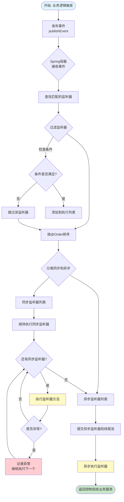
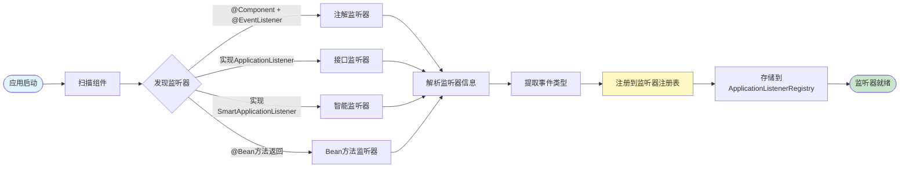
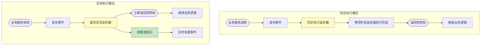
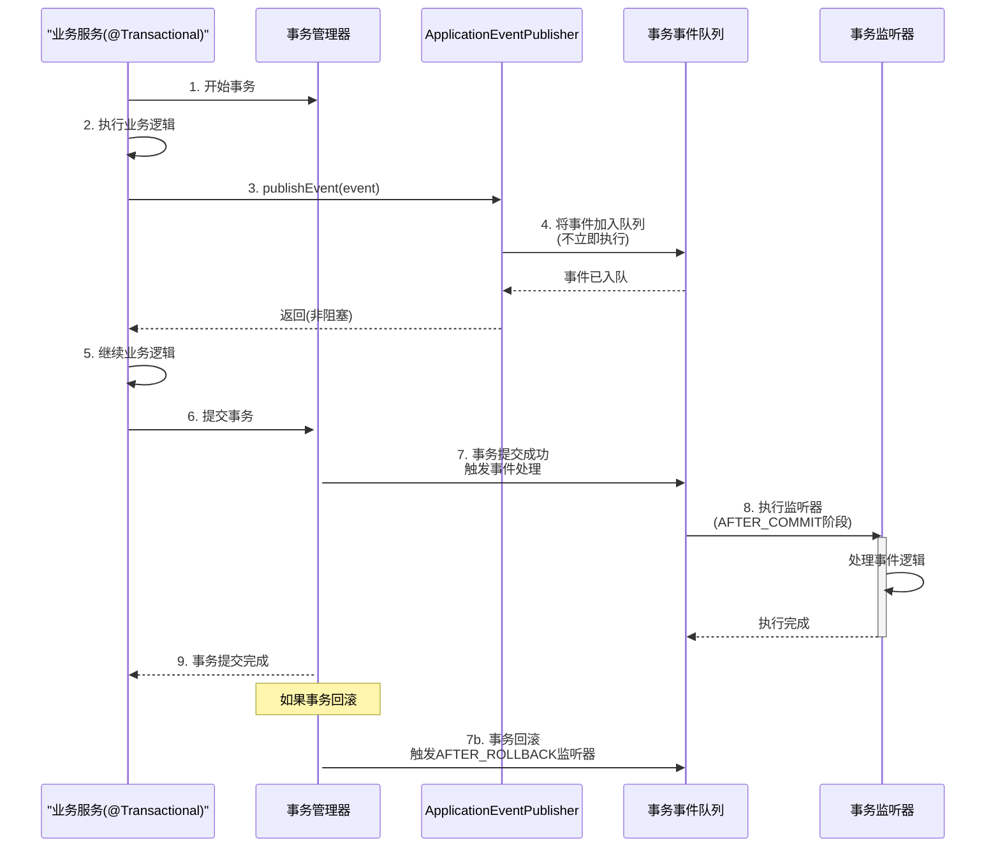

# Spring Boot 监听器详解

> 摘要（TL;DR）
> - 目标：掌握 Spring Boot 监听器机制及使用方法
> - 学会：事件发布、监听器实现、异步处理与最佳实践
> - 收获：解耦业务逻辑、提升系统扩展性与可维护性

## 📚 目录

- [内容概览](#内容概览)
- [5.1 什么是监听器](#51-什么是监听器)
- [5.2 监听器核心组件](#52-监听器核心组件)
- [5.3 监听器实现方式](#53-监听器实现方式)
- [5.4 内置事件详解](#54-内置事件详解)
- [5.5 实战案例](#55-实战案例)
- [5.6 流程分析](#56-流程分析)
- [5.7 高级特性](#57-高级特性)
- [5.8 使用场景](#58-使用场景)
- [5.9 最佳实践](#59-最佳实践)
- [5.10 总结](#510-总结)

---

## 内容概览

本文档全面介绍Spring Boot监听器机制，涵盖以下核心内容：

### 📚 主要内容

#### 第一部分：监听器基础（入门）
- **监听器概念**：什么是监听器，为什么要使用监听器
- **核心组件**：事件、监听器、事件发布器的作用与关系
- **工作原理**：监听器如何被触发和执行

#### 第二部分：实现方式（进阶）
- **接口实现**：通过实现ApplicationListener接口创建监听器
- **注解驱动**：使用@EventListener注解简化监听器开发
- **多种实现方式**：SmartApplicationListener、手动注册等

#### 第三部分：实战应用（实战）
- **内置事件**：Spring Boot提供的应用生命周期事件
- **自定义事件**：创建和发布自定义业务事件
- **实际案例**：用户注册监听、订单处理监听等完整案例

#### 第四部分：深入理解（深入）
- **流程分析**：通过时序图和流程图深入理解事件发布、监听器匹配和执行流程
- **高级特性**：异步处理、执行顺序、条件监听、事务事件监听等
- **使用场景**：常见应用场景和最佳实践

### 🔧 核心注解

| 注解 | 作用 | 说明 |
|------|------|------|
| `@EventListener` | 声明事件监听方法 | 最常用的监听器实现方式 |
| `@Async` | 异步执行监听器 | 需要配合@EnableAsync使用 |
| `@Order` | 指定监听器执行顺序 | 数值越小优先级越高 |
| `@TransactionalEventListener` | 事务事件监听 | 在事务特定阶段触发（AFTER_COMMIT等） |

### 🎯 核心特性

- **解耦合**：业务逻辑与辅助功能分离
- **可扩展**：轻松添加新的事件处理逻辑
- **异步支持**：避免阻塞主业务流程
- **条件控制**：精确控制监听器触发条件

---

## 5.1 什么是监听器

### 🤔 什么是监听器？

**监听器（Listener）**是Spring Boot中基于观察者模式实现的一种机制，用于监听应用程序中特定事件的发生，并在事件触发时执行相应的处理逻辑。

### 💡 生活中的比喻

想象你在餐厅点餐：
- **传统方式**：你点完餐后要一直问服务员"好了吗？好了吗？"
- **监听器方式**：你点完餐后坐下等待，餐做好后服务员会主动通知你

监听器就像餐厅的服务员，当特定事件（餐做好了）发生时，会主动通知订阅了该事件的监听者（你）。

### ✨ 监听器的优势

| 特性 | 传统方式 | 监听器方式 |
|------|---------|-----------|
| 代码耦合度 | 🟥 高 | 🟢 低 |
| 扩展性 | 🟥 差 | 🟢 好 |
| 可维护性 | 🟥 差 | 🟢 好 |
| 性能影响 | 🟥 可能阻塞 | 🟢 可异步处理 |

---

## 5.2 监听器核心组件

### 🧩 核心组件介绍

监听器机制由三个核心组件构成：

#### 1. 事件（Event）
事件是监听器监听的对象，通常继承自`ApplicationEvent`类。

```java
public class CustomEvent extends ApplicationEvent {
    private String message;
    
    public CustomEvent(Object source, String message) {
        super(source);
        this.message = message;
    }
    
    public String getMessage() {
        return message;
    }
}
```

#### 2. 监听器（Listener）
监听器负责监听特定事件，并在事件发生时执行处理逻辑。

#### 3. 事件发布器（Event Publisher）
用于发布事件，触发监听器执行。通常通过`ApplicationEventPublisher`来实现。

```java
@Service
public class EventPublisherService {
    
    @Autowired
    private ApplicationEventPublisher eventPublisher;
    
    public void publishCustomEvent(String message) {
        // 发布事件
        eventPublisher.publishEvent(new CustomEvent(this, message));
    }
}
```

### 🔄 工作原理

监听器的工作流程如下：

1. **事件发布**：通过`ApplicationEventPublisher.publishEvent()`发布事件
2. **事件识别**：Spring容器根据事件类型找到所有匹配的监听器
3. **监听器执行**：按照`@Order`注解指定的顺序依次执行监听器
4. **异常处理**：如果监听器抛出异常，默认会继续执行其他监听器

```
发布事件 → Spring容器接收 → 匹配监听器 → 按顺序执行 → 返回结果
```

---

## 5.3 监听器实现方式

### 🎯 方式一：实现ApplicationListener接口

```java
@Component
public class CustomEventListener implements ApplicationListener<CustomEvent> {
    @Override
    public void onApplicationEvent(CustomEvent event) {
        // 处理事件逻辑
        System.out.println("接收到自定义事件: " + event.getMessage());
    }
}
```

### 🎯 方式二：使用@EventListener注解

```java
@Component
public class CustomEventHandler {
    
    @EventListener
    public void handleCustomEvent(CustomEvent event) {
        // 处理事件逻辑
        System.out.println("接收到自定义事件: " + event.getMessage());
    }
}
```

### 🎯 方式三：使用SmartApplicationListener接口

`SmartApplicationListener`接口提供了更灵活的事件处理能力，可以监听多个事件类型并支持条件判断：

```java
@Component
public class SmartEventListener implements SmartApplicationListener {
    
    @Override
    public boolean supportsEventType(Class<? extends ApplicationEvent> eventType) {
        // 指定支持的事件类型
        return CustomEvent.class.isAssignableFrom(eventType);
    }
    
    @Override
    public boolean supportsSourceType(Class<?> sourceType) {
        // 指定支持的源类型
        return true;
    }
    
    @Override
    public void onApplicationEvent(ApplicationEvent event) {
        CustomEvent customEvent = (CustomEvent) event;
        System.out.println("Smart监听器处理事件: " + customEvent.getMessage());
    }
    
    @Override
    public int getOrder() {
        // 指定执行顺序
        return 0;
    }
}
```

### 🎯 方式四：手动注册监听器

除了使用注解方式注册，还可以在配置类中手动注册监听器：

```java
@Configuration
public class ListenerConfig {
    
    @Bean
    public ApplicationListener<CustomEvent> customEventListener() {
        return event -> {
            System.out.println("手动注册的监听器: " + event.getMessage());
        };
    }
}
```

或在启动类中通过`SpringApplication.addListeners()`方法注册：

```java
@SpringBootApplication
public class App {
    public static void main(String[] args) {
        SpringApplication app = new SpringApplication(App.class);
        app.addListeners(new CustomEventListener());
        app.run(args);
    }
}
```

### 📌 监听多个事件

一个监听器方法可以监听多个事件类型：

```java
@Component
public class MultiEventEventListener {
    
    @EventListener(classes = {CustomEvent.class, UserRegistrationEvent.class})
    public void handleMultipleEvents(ApplicationEvent event) {
        if (event instanceof CustomEvent) {
            CustomEvent customEvent = (CustomEvent) event;
            System.out.println("处理CustomEvent: " + customEvent.getMessage());
        } else if (event instanceof UserRegistrationEvent) {
            UserRegistrationEvent userEvent = (UserRegistrationEvent) event;
            System.out.println("处理UserRegistrationEvent: " + userEvent.getUser());
        }
    }
}
```

---

## 5.4 内置事件详解

Spring Boot提供了多个内置事件，用于监听应用生命周期：

### 📅 应用生命周期事件

| 事件类型 | 触发时机 | 用途 |
|---------|---------|------|
| `ApplicationStartingEvent` | 应用启动时 | 最早触发的事件 |
| `ApplicationEnvironmentPreparedEvent` | Environment准备完成 | 可以访问配置信息 |
| `ApplicationPreparedEvent` | 应用准备完成 | 应用上下文创建完成 |
| `ApplicationStartedEvent` | 应用启动完成 | 但还未接收请求 |
| `ApplicationReadyEvent` | 应用准备就绪 | 可以接收请求 |
| `ApplicationFailedEvent` | 应用启动失败 | 错误处理 |

### 📅 Spring框架级别事件

除了Spring Boot提供的事件，Spring框架本身也提供了多个重要的生命周期事件：

| 事件类型 | 触发时机 | 用途 |
|---------|---------|------|
| `ContextRefreshedEvent` | 应用上下文刷新完成 | Bean初始化完成后触发 |
| `ContextStartedEvent` | 应用上下文启动 | 调用`start()`方法时触发 |
| `ContextStoppedEvent` | 应用上下文停止 | 调用`stop()`方法时触发 |
| `ContextClosedEvent` | 应用上下文关闭 | 应用关闭时触发 |
| `RequestHandledEvent` | HTTP请求处理完成 | Web请求处理完成后触发 |

### 📌 事件监听示例

#### Spring Boot事件监听

```java
@Component
public class ApplicationStartupListener {
    
    private static final Logger logger = LoggerFactory.getLogger(ApplicationStartupListener.class);
    
    @EventListener
    public void handleApplicationReady(ApplicationReadyEvent event) {
        logger.info("应用启动完成，可以接收请求了...");
        // 可以在这里执行一些初始化操作
    }
    
    @EventListener
    public void handleApplicationFailed(ApplicationFailedEvent event) {
        logger.error("应用启动失败", event.getException());
        // 可以在这里进行错误处理
    }
}
```

#### Spring框架事件监听

```java
@Component
public class ContextEventListener {
    
    private static final Logger logger = LoggerFactory.getLogger(ContextEventListener.class);
    
    @EventListener
    public void handleContextRefreshed(ContextRefreshedEvent event) {
        logger.info("应用上下文刷新完成，所有Bean已初始化");
        // 可以在这里执行依赖注入完成后的初始化操作
    }
    
    @EventListener
    public void handleContextClosed(ContextClosedEvent event) {
        logger.info("应用上下文正在关闭");
        // 可以在这里进行资源清理工作
    }
}
```

### 🔍 事件继承关系

Spring的事件机制支持类型继承。如果一个监听器监听父类事件，它也能接收到子类事件：

```java
// 父类事件
public class BaseEvent extends ApplicationEvent {
    // ...
}

// 子类事件
public class CustomEvent extends BaseEvent {
    // ...
}

// 监听父类事件的监听器，也能接收子类事件
@Component
public class BaseEventListener {
    @EventListener
    public void handleBaseEvent(BaseEvent event) {
        // 这个监听器会同时接收BaseEvent和CustomEvent
        System.out.println("接收到事件: " + event.getClass().getName());
    }
}
```

---

## 5.5 实战案例

### 🎯 用户注册事件监听

#### 1. 定义用户注册事件

```java
// 用户注册事件
public class UserRegistrationEvent extends ApplicationEvent {
    private User user;
    
    public UserRegistrationEvent(Object source, User user) {
        super(source);
        this.user = user;
    }
    
    public User getUser() {
        return user;
    }
}
```

#### 2. 创建用户注册监听器

```java
// 用户注册监听器
@Component
public class UserRegistrationListener {
    
    private static final Logger logger = LoggerFactory.getLogger(UserRegistrationListener.class);
    
    @EventListener
    public void handleUserRegistration(UserRegistrationEvent event) {
        User user = event.getUser();
        logger.info("新用户注册: {}", user.getUsername());
        
        // 发送欢迎邮件
        sendWelcomeEmail(user);
        
        // 记录用户注册日志
        logUserRegistration(user);
    }
    
    private void sendWelcomeEmail(User user) {
        // 发送邮件逻辑
    }
    
    private void logUserRegistration(User user) {
        // 记录日志逻辑
    }
}
```

#### 3. 在服务中发布事件

```java
@Service
public class UserService {
    
    @Autowired
    private ApplicationEventPublisher eventPublisher;
    
    public void registerUser(User user) {
        // 用户注册逻辑
        // ...
        
        // 发布用户注册事件
        eventPublisher.publishEvent(new UserRegistrationEvent(this, user));
    }
}
```

### 🛒 订单处理事件监听（完整案例）

这是一个更完整的实际业务场景示例：

#### 1. 定义订单相关事件

```java
// 订单创建事件
public class OrderCreatedEvent extends ApplicationEvent {
    private Order order;
    
    public OrderCreatedEvent(Object source, Order order) {
        super(source);
        this.order = order;
    }
    
    public Order getOrder() {
        return order;
    }
}

// 订单支付成功事件
public class OrderPaidEvent extends ApplicationEvent {
    private Order order;
    private Payment payment;
    
    public OrderPaidEvent(Object source, Order order, Payment payment) {
        super(source);
        this.order = order;
        this.payment = payment;
    }
    
    public Order getOrder() {
        return order;
    }
    
    public Payment getPayment() {
        return payment;
    }
}
```

#### 2. 创建多个监听器处理不同业务

```java
// 库存扣减监听器
@Component
@Order(1) // 优先执行
public class InventoryDeductionListener {
    
    @EventListener
    public void handleOrderCreated(OrderCreatedEvent event) {
        Order order = event.getOrder();
        // 扣减库存
        deductInventory(order);
    }
    
    private void deductInventory(Order order) {
        // 库存扣减逻辑
    }
}

// 发送通知监听器
@Component
@Order(2)
public class NotificationListener {
    
    @EventListener
    @Async
    public void handleOrderPaid(OrderPaidEvent event) {
        Order order = event.getOrder();
        // 异步发送支付成功通知
        sendPaymentNotification(order);
    }
    
    @EventListener
    @Async
    public void handleOrderCreated(OrderCreatedEvent event) {
        Order order = event.getOrder();
        // 异步发送订单创建通知
        sendOrderCreatedNotification(order);
    }
    
    private void sendPaymentNotification(Order order) {
        // 发送通知逻辑
    }
    
    private void sendOrderCreatedNotification(Order order) {
        // 发送通知逻辑
    }
}

// 积分奖励监听器
@Component
@Order(3)
@TransactionalEventListener(phase = TransactionPhase.AFTER_COMMIT)
public class PointsRewardListener {
    
    @EventListener
    public void handleOrderPaid(OrderPaidEvent event) {
        Order order = event.getOrder();
        // 事务提交后给用户增加积分
        addPointsToUser(order);
    }
    
    private void addPointsToUser(Order order) {
        // 积分增加逻辑
    }
}
```

#### 3. 在服务中发布事件

```java
@Service
@Transactional
public class OrderService {
    
    @Autowired
    private ApplicationEventPublisher eventPublisher;
    
    @Autowired
    private OrderRepository orderRepository;
    
    public void createOrder(Order order) {
        // 1. 保存订单
        orderRepository.save(order);
        
        // 2. 发布订单创建事件
        eventPublisher.publishEvent(new OrderCreatedEvent(this, order));
    }
    
    public void payOrder(Long orderId, Payment payment) {
        // 1. 更新订单状态
        Order order = orderRepository.findById(orderId).orElseThrow();
        order.setStatus(OrderStatus.PAID);
        orderRepository.save(order);
        
        // 2. 发布订单支付成功事件（在事务上下文中）
        eventPublisher.publishEvent(new OrderPaidEvent(this, order, payment));
        // 注意：如果在@Transactional方法中，监听器可以使用@TransactionalEventListener
    }
}
```

---

## 5.6 流程分析

### 📊 事件发布与处理流程

在掌握了监听器的基本使用后，让我们深入理解监听器机制的核心流程。本节通过时序图和流程图详细说明事件发布、监听器匹配和执行等关键步骤。

### 🔄 事件发布时序图

以下时序图展示了从事件发布到监听器执行的完整流程：

```
发布事件 → Spring容器接收 → 匹配监听器 → 按顺序执行 → 返回结果
```

### 🗺️ 事件处理流程图

以下流程图展示了事件处理的详细步骤和分支逻辑：



### 🔍 监听器注册流程

以下流程图展示了监听器在Spring容器中的注册过程：



### ⚡ 同步vs异步执行流程对比

以下流程图对比了同步和异步两种执行模式：



### 🔐 事务事件监听流程

以下时序图展示了`@TransactionalEventListener`在事务环境下的执行流程：



### 📋 关键流程说明

#### 1. 事件发布流程
- **步骤1**：业务服务调用`ApplicationEventPublisher.publishEvent()`
- **步骤2**：Spring容器接收事件对象
- **步骤3**：容器查找所有匹配的监听器（根据事件类型）
- **步骤4**：按`@Order`注解排序监听器
- **步骤5**：分离同步和异步监听器

#### 2. 监听器匹配流程
- **类型匹配**：检查监听器监听的事件类型是否与发布的事件匹配
- **条件匹配**：如果使用`condition`属性，评估SpEL表达式
- **源类型匹配**：对于`SmartApplicationListener`，检查source类型

#### 3. 同步执行流程
- **顺序执行**：按照`@Order`值从小到大依次执行
- **异常隔离**：监听器异常不影响其他监听器
- **阻塞等待**：主线程等待所有同步监听器执行完成

#### 4. 异步执行流程
- **线程池提交**：将异步监听器提交到线程池
- **立即返回**：不等待异步监听器执行完成
- **并发执行**：多个异步监听器可以并发执行

#### 5. 事务事件监听流程
- **事件入队**：事务中的事件先加入队列，不立即执行
- **延迟触发**：在事务提交/回滚的特定阶段触发
- **事务隔离**：确保事件处理在正确的事务阶段执行

### 💡 流程关键点总结

| 流程阶段 | 关键点 | 说明 |
|---------|--------|------|
| **事件发布** | 非阻塞 | 同步监听器会阻塞，异步监听器不会 |
| **监听器匹配** | 类型继承 | 监听父类事件的监听器也能接收子类事件 |
| **执行顺序** | @Order控制 | 数值越小优先级越高 |
| **异常处理** | 隔离机制 | 监听器异常不影响主流程和其他监听器 |
| **事务监听** | 延迟执行 | 在事务特定阶段才执行，保证数据一致性 |

---

## 5.7 高级特性

### ⚡ 异步处理

默认情况下，监听器是在同一个线程中同步执行的。如果监听器处理逻辑较重，可能会影响主业务流程的性能。

```java
@Component
public class AsyncEventListener {
    
    @EventListener
    @Async
    public void handleCustomEvent(CustomEvent event) {
        // 异步处理事件
        System.out.println("异步处理事件: " + event.getMessage());
    }
}
```

需要在启动类上添加`@EnableAsync`注解启用异步支持。

### 🔢 执行顺序

如果有多个监听器监听同一事件，可以通过`@Order`注解指定执行顺序：

```java
@Component
@Order(1)
public class FirstEventListener {
    
    @EventListener
    public void handleCustomEvent(CustomEvent event) {
        System.out.println("第一个监听器处理事件");
    }
}

@Component
@Order(2)
public class SecondEventListener {
    
    @EventListener
    public void handleCustomEvent(CustomEvent event) {
        System.out.println("第二个监听器处理事件");
    }
}
```

### 🎯 条件监听

可以使用`@EventListener`的condition属性实现条件监听：

```java
@Component
public class ConditionalEventListener {
    
    @EventListener(condition = "#event.message.length() > 5")
    public void handleLongMessageEvent(CustomEvent event) {
        System.out.println("只处理消息长度大于5的事件: " + event.getMessage());
    }
}
```

### 🛡️ 异常处理

监听器中的异常不会影响主业务流程，但需要适当处理以避免数据不一致：

```java
@Component
public class SafeEventListener {
    
    private static final Logger logger = LoggerFactory.getLogger(SafeEventListener.class);
    
    @EventListener
    public void handleCustomEvent(CustomEvent event) {
        try {
            // 处理事件逻辑
            processEvent(event);
        } catch (Exception e) {
            logger.error("处理事件时发生异常", e);
            // 可以选择重新入队、记录错误日志等处理方式
        }
    }
    
    private void processEvent(CustomEvent event) {
        // 具体处理逻辑
    }
}
```

### 💾 事务事件监听

`@TransactionalEventListener`注解允许在事务的特定阶段触发监听器，这对于需要在事务提交后执行的操作非常有用：

```java
@Component
public class TransactionalEventListener {
    
    @TransactionalEventListener(phase = TransactionPhase.AFTER_COMMIT)
    public void handleAfterCommit(CustomEvent event) {
        // 事务提交后执行
        System.out.println("事务已提交，处理事件: " + event.getMessage());
    }
    
    @TransactionalEventListener(phase = TransactionPhase.AFTER_ROLLBACK)
    public void handleAfterRollback(CustomEvent event) {
        // 事务回滚后执行
        System.out.println("事务已回滚，处理事件: " + event.getMessage());
    }
    
    @TransactionalEventListener(phase = TransactionPhase.BEFORE_COMMIT)
    public void handleBeforeCommit(CustomEvent event) {
        // 事务提交前执行
        System.out.println("事务提交前，处理事件: " + event.getMessage());
    }
}
```

**事务阶段说明：**

| 阶段 | 说明 |
|------|------|
| `AFTER_COMMIT` | 事务提交成功后执行（默认） |
| `AFTER_ROLLBACK` | 事务回滚后执行 |
| `BEFORE_COMMIT` | 事务提交前执行 |
| `AFTER_COMPLETION` | 事务完成后执行（无论提交还是回滚） |

**注意事项：**
- 使用`@TransactionalEventListener`时，事件必须是在事务上下文中发布的
- 如果不在事务中发布事件，需要使用`fallbackExecution = true`来确保监听器能够执行

```java
@TransactionalEventListener(phase = TransactionPhase.AFTER_COMMIT, fallbackExecution = true)
public void handleEvent(CustomEvent event) {
    // 即使在非事务环境下也会执行
}
```

### 🧵 线程模型详解

#### 同步执行（默认）

默认情况下，监听器在发布事件的同一线程中同步执行：

```java
// 主线程
@Service
public class UserService {
    @Autowired
    private ApplicationEventPublisher publisher;
    
    public void registerUser(User user) {
        // 1. 主线程执行
        publisher.publishEvent(new UserRegistrationEvent(this, user));
        // 2. 监听器在同一线程中同步执行
        // 3. 所有监听器执行完成后，继续执行后续代码
    }
}
```

#### 异步执行

使用`@Async`注解可以实现异步执行，监听器会在独立的线程池中执行：

```java
@Configuration
@EnableAsync
public class AsyncConfig implements AsyncConfigurer {
    
    @Override
    public Executor getAsyncExecutor() {
        ThreadPoolTaskExecutor executor = new ThreadPoolTaskExecutor();
        executor.setCorePoolSize(5);
        executor.setMaxPoolSize(10);
        executor.setQueueCapacity(100);
        executor.setThreadNamePrefix("async-event-");
        executor.initialize();
        return executor;
    }
}

@Component
public class AsyncEventListener {
    @EventListener
    @Async
    public void handleEvent(CustomEvent event) {
        // 在异步线程中执行
        System.out.println("异步线程: " + Thread.currentThread().getName());
    }
}
```

---

## 5.8 使用场景

### 🎯 常见使用场景

#### 1. 应用生命周期监控
- 应用启动完成后的初始化操作
- 应用关闭前的资源清理工作

#### 2. 业务事件处理
- 用户注册后发送欢迎邮件
- 订单创建后更新库存
- 支付成功后发送通知

#### 3. 日志记录与审计
- 记录重要业务操作日志
- 用户行为审计跟踪

#### 4. 数据同步
- 主数据变更后同步到其他系统
- 缓存更新通知

#### 5. 异步任务处理
- 耗时操作的异步处理
- 消息通知发送

#### 6. 缓存管理
- 数据变更后清除相关缓存
- 缓存预热处理

#### 7. 指标收集
- 业务指标统计
- 性能监控数据收集

---

## 5.9 最佳实践

### ✅ 推荐做法

1. **合理使用异步处理**：对于耗时操作，使用`@Async`注解避免阻塞主流程
2. **注意异常处理**：监听器中的异常不应影响主业务流程
3. **避免循环依赖**：监听器中发布新事件时要注意避免形成循环
4. **控制监听器数量**：过多的监听器可能影响应用性能
5. **使用条件监听**：通过condition属性精确控制监听器的触发条件

### ❌ 避免的做法

1. **避免在监听器中执行复杂业务逻辑**：应该只做事件处理，复杂逻辑应调用服务层
2. **避免在监听器中抛出未处理异常**：会影响其他监听器执行
3. **避免在监听器中进行阻塞操作**：应使用异步处理
4. **避免在监听器中修改事件对象**：事件应该是不可变的，修改可能影响其他监听器
5. **避免监听器之间的相互依赖**：保持监听器独立，避免形成调用链

### 🧪 监听器测试

测试监听器时，可以使用Spring的测试框架：

```java
@SpringBootTest
class UserRegistrationListenerTest {
    
    @Autowired
    private ApplicationEventPublisher eventPublisher;
    
    @Autowired
    private UserRegistrationListener listener;
    
    @MockBean
    private EmailService emailService; // 模拟邮件服务
    
    @Test
    void testUserRegistrationEvent() {
        // 创建测试用户
        User user = new User();
        user.setUsername("testuser");
        user.setEmail("test@example.com");
        
        // 发布事件
        UserRegistrationEvent event = new UserRegistrationEvent(this, user);
        eventPublisher.publishEvent(event);
        
        // 验证邮件服务被调用
        verify(emailService, times(1)).sendWelcomeEmail(user);
    }
}
```

或者使用`@TestConfiguration`创建独立的测试配置：

```java
@SpringBootTest
class CustomEventListenerTest {
    
    @Autowired
    private ApplicationEventPublisher eventPublisher;
    
    private List<String> receivedEvents = new ArrayList<>();
    
    @TestConfiguration
    static class TestConfig {
        @Bean
        public ApplicationListener<CustomEvent> testListener() {
            return event -> {
                // 在测试中收集事件
                receivedEvents.add(event.getMessage());
            };
        }
    }
    
    @Test
    void testEventPublishing() {
        eventPublisher.publishEvent(new CustomEvent(this, "test message"));
        
        assertThat(receivedEvents).containsExactly("test message");
    }
}
```

### ⚡ 性能优化建议

1. **合理使用异步处理**：对于耗时操作，务必使用`@Async`避免阻塞
2. **控制监听器数量**：过多的监听器会影响事件发布性能
3. **优化事件对象**：事件对象应尽量轻量，避免包含大量数据
4. **使用条件监听**：通过`condition`属性减少不必要的监听器执行
5. **批量事件处理**：对于高频事件，考虑批量处理机制

```java
@Component
public class OptimizedEventListener {
    
    // 使用条件监听，只处理满足条件的事件
    @EventListener(condition = "#event.priority == 'HIGH'")
    @Async
    public void handleHighPriorityEvent(CustomEvent event) {
        // 只处理高优先级事件，异步执行
    }
}
```

---

## 5.10 总结

### 📝 本章要点回顾

1. **监听器概念**：基于观察者模式的事件处理机制
2. **核心组件**：事件、监听器、事件发布器及其工作原理
3. **实现方式**：接口实现、注解驱动、SmartApplicationListener、手动注册
4. **内置事件**：Spring Boot应用生命周期事件和Spring框架级别事件
5. **实战案例**：用户注册监听、订单处理监听等实际业务场景
6. **流程分析**：事件发布、监听器匹配、同步/异步执行、事务事件监听的完整流程
7. **高级特性**：
   - 异步处理（@Async）
   - 执行顺序控制（@Order）
   - 条件监听（condition属性）
   - 事务事件监听（@TransactionalEventListener）
   - 异常处理策略
   - 线程模型（同步vs异步）
8. **使用场景**：生命周期监控、业务事件处理、日志审计、数据同步、异步任务等
9. **最佳实践**：
   - 合理使用异步处理
   - 注意异常处理
   - 避免循环依赖
   - 保持事件对象不可变
   - 控制监听器数量
10. **测试方法**：使用Spring测试框架测试监听器功能
11. **性能优化**：异步处理、条件监听、事件对象轻量化

### 🎯 学习建议

1. **动手实践**：创建简单的监听器并测试其工作原理
2. **理解原理**：深入理解观察者模式在Spring中的实现，掌握事件发布和执行流程
3. **关注性能**：合理使用异步处理避免阻塞主流程，控制监听器数量
4. **注意异常**：确保监听器中的异常不会影响主业务流程
5. **掌握高级特性**：熟练使用事务事件监听、条件监听等高级功能
6. **编写测试**：为监听器编写单元测试，确保功能正确性

### 🔍 关键知识点总结

| 知识点 | 说明 |
|--------|------|
| **事件继承** | 监听父类事件的监听器也能接收子类事件 |
| **同步vs异步** | 默认同步执行，使用@Async实现异步 |
| **执行顺序** | 通过@Order控制多个监听器的执行顺序 |
| **事务监听** | @TransactionalEventListener在事务特定阶段触发 |
| **条件监听** | 使用condition属性精确控制触发条件 |
| **异常隔离** | 监听器异常不影响主业务流程和其他监听器 |

### 🚀 下一步学习

- [6. Spring Boot Actuator](6.springboot-actuator.md)：学习应用监控与管理
- [7. Spring Boot 部署](7.springboot-deploy.md)：学习应用部署方式

> **🎉 恭喜！** 你已经掌握了Spring Boot监听器的核心知识，可以开始在项目中应用了！